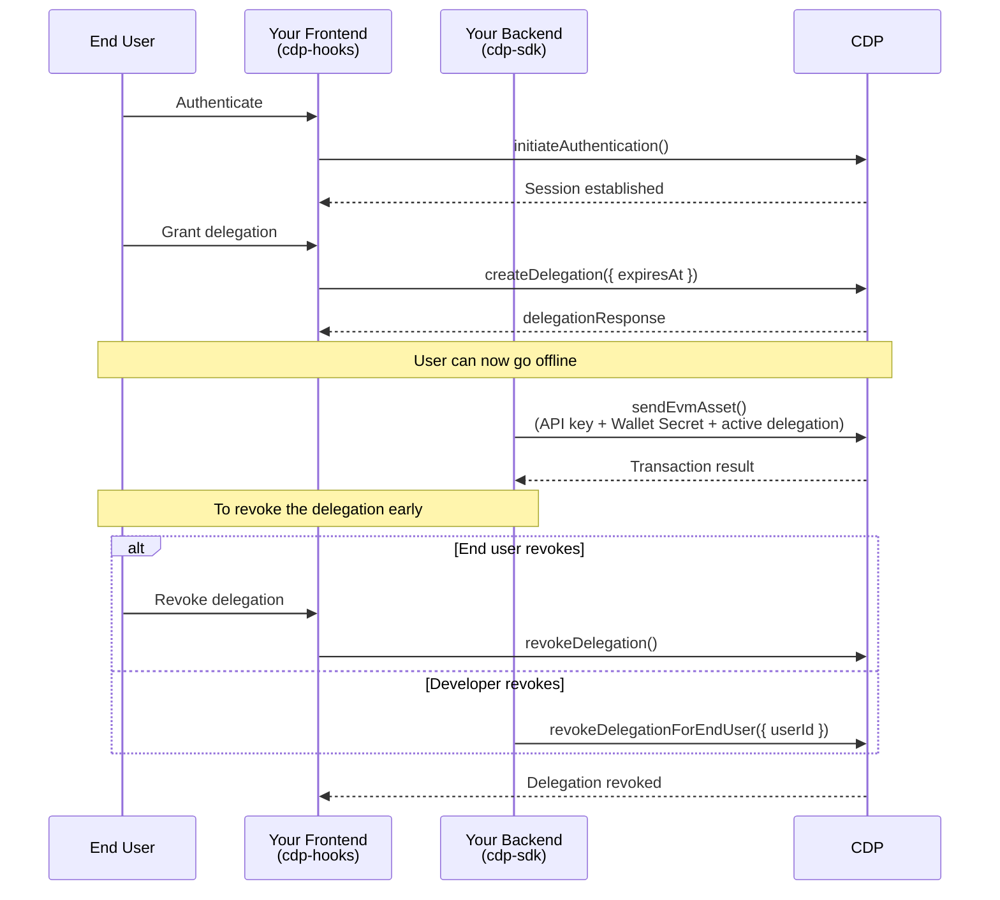

> Coinbase CDP docs — **auth** · [index](../../README.md) · [all pages](../../MANIFEST.md)

# Delegated Signing

export const Tags = ({tags, className}) => {
  if (!tags || !Array.isArray(tags)) {
    return null;
  }
  return <div className={`mt-5 mb-5 flex flex-row flex-wrap gap-2 ${className}`}>
      {tags.map((tag, index) => <span key={index} className="text-sm text-[#733E00] dark:text-yellow-500 bg-[#FFFCF1] dark:bg-yellow-500/10 font-semibold px-2 py-1 rounded-lg">{tag}</span>)}
    </div>;
};

<Tags tags={["EVM", "Solana", "User Wallet"]} />

## Overview

Delegated signing lets your backend sign transactions on behalf of end users without requiring them to be online or have an active session. The end user grants a time-bound delegation from your frontend, and your server can then take actions on their account using only your CDP API key and Wallet Secret.

This is useful for:

* **Automated transactions** — Execute transactions triggered by webhooks or onchain events when the user is offline
* **Agentic wallets** — Allow a backend service or agent to operate a user's wallet with scoped permissions
* **Background operations** — Process user-initiated flows that complete asynchronously after the user has left your app

## How it works

Two parties are involved:

* **End user** — Authenticates on your frontend and grants a time-bound delegation to your app
* **Developer** — Uses their CDP API key, CDP Wallet Secret, and the active delegation to sign transactions from the backend with no user interaction required

### Delegation scopes

There are two available delegation scopes:

| | User-scoped | Account-scoped |
| - | - | - |
| Grant covers | All of a user's accounts | One specific account |
| Active delegations per user | One | One per account |
| Revocation granularity | All accounts at once | One account at a time |

User-scoped and account-scoped delegations are mutually exclusive per user. To switch scopes, revoke all existing delegations first.

The flow:

1. **Grant** — The authenticated end user calls `createDelegation` on the frontend, specifying an expiry time
2. **Sign** — Your backend uses the CDP SDK with your API key to perform actions on behalf of the user
3. **Revoke** — The delegation can be revoked before expiry by the end user or the developer



## Available delegated signing methods

With an active delegation, your backend can call the following methods via `cdp.endUser.*` on behalf of an end user:

### EVM: Sign

| Method | Description |
| - | - |
| `signEvmTransaction({ userId, address, transaction })` | Sign an EVM transaction |
| `signEvmMessage({ userId, address, message })` | Sign an EIP-191 message |
| `signEvmTypedData({ userId, address, typedData })` | Sign EIP-712 typed data |

### EVM: Send

| Method | Description |
| - | - |
| `sendEvmTransaction({ userId, address, transaction, network })` | Send a signed EVM transaction |
| `sendEvmAsset({ userId, address, to, amount, network })` | Send an EVM asset (e.g. USDC) |
| `sendUserOperation({ userId, address, network, calls })` | Send a smart account user operation |
| `createEvmEip7702Delegation({ userId, address, network })` | Create an EIP-7702 delegation |

### Solana: Sign

| Method | Description |
| - | - |
| `signSolanaMessage({ userId, address, message })` | Sign a Solana message |
| `signSolanaTransaction({ userId, address, transaction })` | Sign a Solana transaction |

### Solana: Send

| Method | Description |
| - | - |
| `sendSolanaTransaction({ userId, address, transaction, network })` | Send a signed Solana transaction |
| `sendSolanaAsset({ userId, address, to, amount, network })` | Send a Solana asset (e.g. USDC) |

## Prerequisites

1. In the [CDP Portal](https://portal.cdp.coinbase.com/wallets/non-custodial/security), go to **Wallets** → **Non-custodial Wallet** → **Security** and enable the **Delegated Signing** toggle.

2. Install the required packages:

**Frontend** (`@coinbase/cdp-hooks`):

<CodeGroup>
  ```bash npm theme={null}
  npm install @coinbase/cdp-core @coinbase/cdp-hooks
  ```

  ```bash pnpm theme={null}
  pnpm add @coinbase/cdp-core @coinbase/cdp-hooks
  ```

  ```bash yarn theme={null}
  yarn add @coinbase/cdp-core @coinbase/cdp-hooks
  ```
</CodeGroup>

**Backend** (`cdp-sdk`):

<Tabs groupId="programming-language">
  <Tab title="TypeScript">
    <CodeGroup>
      ```bash npm theme={null}
      npm install @coinbase/cdp-sdk dotenv
      ```

      ```bash pnpm theme={null}
      pnpm add @coinbase/cdp-sdk dotenv
      ```

      ```bash yarn theme={null}
      yarn add @coinbase/cdp-sdk dotenv
      ```
    </CodeGroup>
  </Tab>

  <Tab title="Python">
    ```bash theme={null}
    pip install cdp-sdk python-dotenv
    ```
  </Tab>
</Tabs>

Sign in to the [CDP Portal](https://portal.cdp.coinbase.com), [create a CDP API key](https://portal.cdp.coinbase.com/api-keys/secret) and [generate a Wallet Secret](https://portal.cdp.coinbase.com/wallets/non-custodial/security). Add them to your `.env` file:

```bash .env theme={null}
CDP_API_KEY_ID=your-api-key-id
CDP_API_KEY_SECRET=your-api-key-secret
CDP_WALLET_SECRET=your-wallet-secret
```

Then instantiate the CDP client in your backend:

<CodeGroup>
  ```ts TypeScript theme={null}
  import { CdpClient } from "@coinbase/cdp-sdk";
  import "dotenv/config";

  const cdp = new CdpClient();
  ```

  ```python Python theme={null}
  import asyncio
  from cdp import CdpClient
  from dotenv import load_dotenv

  load_dotenv()

  async def main():
      async with CdpClient() as cdp:
          pass  # Your code here

  asyncio.run(main())
  ```
</CodeGroup>

<Note>
  **TypeScript only:** Set `moduleResolution: "node16"` or `"nodenext"` in your `tsconfig.json` to avoid compilation errors with the CDP SDK.
</Note>

## Step 1: End user creates a delegation (React)

The authenticated end user grants your app a time-bound delegation. This is the only step that requires the user to be present.

### User-scoped

A user-scoped delegation covers all of a user's accounts.

<Info>
  Only one active user-scoped delegation is allowed per user at a time. If a delegation already exists, revoke it or let it expire before creating a new one.
</Info>

```tsx React theme={null}
import { useCreateDelegation, useCurrentUser } from "@coinbase/cdp-hooks";

function DelegateButton() {
  const { currentUser } = useCurrentUser();
  const { createDelegation } = useCreateDelegation();

  const handleDelegate = async () => {
    // Delegation expires in 24 hours
    const expiresAt = new Date(Date.now() + 24 * 60 * 60 * 1000).toISOString();
    const result = await createDelegation({ expiresAt });
    console.log("Delegation ID:", result.delegationId);
  };

  return (
    <button disabled={!currentUser} onClick={handleDelegate}>
      Grant Delegation
    </button>
  );
}
```

### Account-scoped

An account-scoped delegation covers one specific account. This lets you revoke access for a single account without affecting other delegations you hold for the same user.

<Info>
  One active account-scoped delegation is allowed per account at a time. If a delegation already exists for that account, revoke it or let it expire before creating a new one.
</Info>

```tsx React theme={null}
import { useCreateDelegationForAccount, useCurrentUser } from "@coinbase/cdp-hooks";

function DelegateAccountButton({ address }: { address: string }) {
  const { currentUser } = useCurrentUser();
  const { createDelegationForAccount } = useCreateDelegationForAccount();

  const handleDelegate = async () => {
    // Delegation expires in 24 hours
    const expiresAt = new Date(Date.now() + 24 * 60 * 60 * 1000).toISOString();
    const result = await createDelegationForAccount({ address, expiresAt });
    console.log("Delegation ID:", result.delegationId);
  };

  return (
    <button disabled={!currentUser} onClick={handleDelegate}>
      Grant Delegation
    </button>
  );
}
```

## Step 2: Developer signs on behalf of the end user

Once a delegation is active, your backend can submit transactions for the end user using your CDP API key and Wallet Secret — no user session needed. The signing API is the same regardless of delegation scope.

<CodeGroup>
  ```ts TypeScript theme={null}
  import { CdpClient } from "@coinbase/cdp-sdk";

  const cdp = new CdpClient();

  const endUser = await cdp.endUser.getEndUser({ userId: "<USER_UUID>" });
  const address = endUser.evmAccountObjects[0].address;

  const result = await cdp.endUser.sendEvmTransaction({
    userId: endUser.userId,
    address: address,
    transaction: "0x02...", // RLP-serialized EIP-1559 transaction
    network: "base-sepolia",
  });
  console.log("Transaction hash:", result.transactionHash);
  ```

  ```python Python theme={null}
  import asyncio
  from cdp import CdpClient
  from dotenv import load_dotenv

  load_dotenv()

  async def main():
      async with CdpClient() as cdp:
          end_user = await cdp.end_user.get_end_user(user_id="<USER_UUID>")
          address = end_user.evm_account_objects[0].address

          result = await cdp.end_user.send_evm_transaction(
              user_id=end_user.user_id,
              address=address,
              transaction="0x02...",  # RLP-serialized EIP-1559 transaction
              network="base-sepolia",
          )
          print("Transaction hash:", result.transaction_hash)

  asyncio.run(main())
  ```
</CodeGroup>

## Step 3: Revoke a delegation

A delegation can be revoked before it expires — either by the end user from the frontend, or by the developer from the backend.

### User-scoped

Revoking a user-scoped delegation removes access across all of the user's accounts.

**End user revokes (React)**

```tsx React theme={null}
import { useRevokeDelegation } from "@coinbase/cdp-hooks";

function RevokeButton() {
  const { revokeDelegation } = useRevokeDelegation();

  const handleRevoke = async () => {
    await revokeDelegation();
    console.log("All delegations revoked.");
  };

  return <button onClick={handleRevoke}>Revoke All Delegations</button>;
}
```

**Developer revokes**

<CodeGroup>
  ```ts TypeScript theme={null}
  import { CdpClient } from "@coinbase/cdp-sdk";

  const cdp = new CdpClient();

  await cdp.endUser.revokeDelegationForEndUser({
    userId: "<USER_UUID>",
  });
  ```

  ```python Python theme={null}
  import asyncio
  from cdp import CdpClient
  from dotenv import load_dotenv

  load_dotenv()

  async def main():
      async with CdpClient() as cdp:
          await cdp.end_user.revoke_delegation(user_id="<USER_UUID>")

  asyncio.run(main())
  ```
</CodeGroup>

### Account-scoped

Revoking an account-scoped delegation removes access for one account and leaves all other account delegations for that user intact.

**End user revokes (React)**

```tsx React theme={null}
import { useRevokeDelegationForAccount } from "@coinbase/cdp-hooks";

function RevokeAccountButton({ address }: { address: string }) {
  const { revokeDelegationForAccount } = useRevokeDelegationForAccount();

  const handleRevoke = async () => {
    await revokeDelegationForAccount({ address });
    console.log("Delegation revoked for", address);
  };

  return <button onClick={handleRevoke}>Revoke Delegation</button>;
}
```

**Developer revokes**

<CodeGroup>
  ```ts TypeScript theme={null}
  import { CdpClient } from "@coinbase/cdp-sdk";

  const cdp = new CdpClient();

  await cdp.endUser.revokeDelegationForEndUserAccount({
    userId: "<USER_UUID>",
    address: "0xabc...123",
  });
  ```

  ```python Python theme={null}
  import asyncio
  from cdp import CdpClient
  from dotenv import load_dotenv

  load_dotenv()

  async def main():
      async with CdpClient() as cdp:
          await cdp.end_user.revoke_delegation_for_end_user_account(
              user_id="<USER_UUID>",
              address="0xabc...123",
          )

  asyncio.run(main())
  ```
</CodeGroup>
