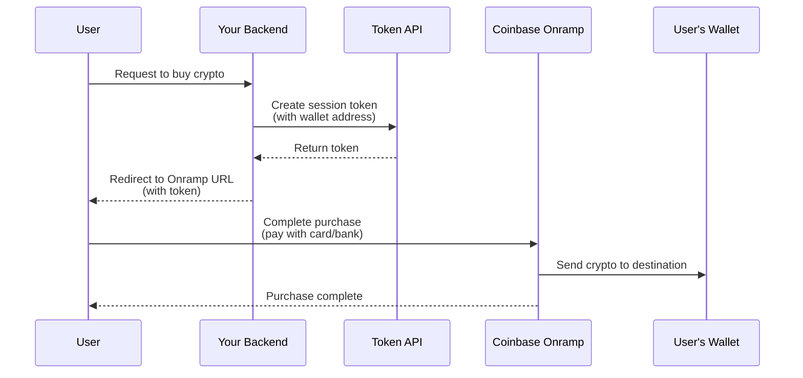

> Coinbase CDP docs — **onramp-offramp** · [index](../../README.md) · [all pages](../../MANIFEST.md)

# Onramp: Overview

Coinbase Onramp allows your users to convert fiat currency into crypto and send it to any wallet. Users can onramp by logging in with their Coinbase account or using Guest Checkout with a debit card, Apple Pay, or Google Pay (no Coinbase account required).

<Warning>
  **Will be deprecated on June 30, 2026:** Guest Checkout (debit card, Apple Pay) via the Coinbase-hosted Onramp widget is being discontinued. Use the [Headless Onramp API](/onramp/headless-onramp/overview) instead — you get access immediately after your app is approved.
</Warning>

<Tip>
  **New to Onramp?** Start with the [Quickstart guide](/onramp/introduction/quickstart) to get up and running in minutes.
</Tip>

<Card title="Apply for Onramp Access" icon="file-pen" href="https://support.cdp.coinbase.com/onramp-onboarding">
  To get full access to Coinbase Onramp & Offramp beyond trial mode limits, complete the onboarding form.
</Card>

## How it works

Whether you choose Coinbase-hosted or Headless Onramp, the basic flow is the same:

<Warning>
  **Important:** Session tokens are single-use and expire after 5 minutes. You must create a new token for each user session.
</Warning>

## Integration options

<CardGroup cols={2}>
  <Card title="Coinbase-hosted Onramp" icon="browser" href="/onramp/coinbase-hosted-onramp/overview">
    **Easiest to integrate.** Redirect users to a Coinbase-hosted page where they complete purchases.

    * Coinbase account payment methods
    * Global for Coinbase users
    * No developer fees
  </Card>

  <Card title="Headless Onramp" icon="mobile" href="/onramp/headless-onramp/overview">
    **Native in-app experience.** Embed Apple Pay or Google Pay onramp directly in your iOS, Android, or web app.

    * Card payment methods only
    * Up to \$2.5K weekly for cards
    * US-only
    * Access fee required
  </Card>

  <Card title="App2App" icon="arrow-right-arrow-left" href="/onramp/app2app/overview">
    **Deep-link into the Coinbase app.** Your app authenticates with device attestation instead of a CDP API key, then hands the user off to the Coinbase app to complete the purchase.

    * iOS only today
    * Allowlist required
    * No CDP API key on the purchase path
  </Card>
</CardGroup>

<Tip>
  **Not sure which to choose?** For Apple Pay or debit card flows, start with the [Headless Onramp API](/onramp/headless-onramp/overview) — you get access immediately after your app is approved. Use Coinbase-hosted Onramp when you need the full Coinbase account login experience.
</Tip>

## What to read next

* **[Quickstart](/onramp/introduction/quickstart):** Get up and running with Coinbase-hosted Onramp in minutes
* **[Security Requirements](/onramp/security-requirements):** Implement CORS and authentication for production
* **[Webhooks](/webhooks/onramp):** Receive real-time transaction notifications
* **[Sandbox Testing](/onramp/headless-onramp/overview#testing):** Test your integration without real funds
