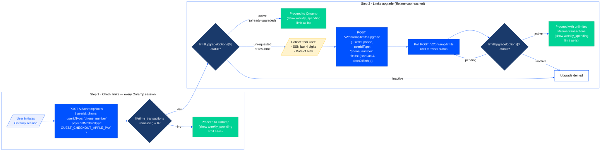

> Coinbase CDP docs — **onramp-offramp** · [index](../../README.md) · [all pages](../../MANIFEST.md)

# Limits Upgrade

Guest Checkout users start with conservative weekly spending and lifetime transaction limits. After a user completes at least 1 transaction, the [Limits Upgrade API](https://docs.cdp.coinbase.com/api-reference/v2/rest-api/onramp/request-limit-upgrade) lets them unlock unlimited lifetime transactions by verifying their identity with just two pieces of information: the last 4 digits of their SSN and their date of birth.

Limits Upgrade removes the main blocker for repeat Guest Checkout users: the lifetime transaction cap. Users who would otherwise stop at about 15 purchases can continue transacting after they verify their identity.

Fewer users hit weekly spending limits in practice because Coinbase’s dynamic risk model raises weekly limits based on transaction history, moving power users toward the 2,500 USD maximum over time. Submitting identity information is a positive signal for that model, but it does not immediately set the weekly limit to 2,500 USD.

<Info>
  Limits Upgrade is only available for Guest Checkout (Headless Onramp) users. Authenticated Coinbase users have separate limit management through their Coinbase account.
</Info>

## Default and upgraded limits

| Limit | Default | After upgrade |
| - | - | - |
| Weekly spending | \$500 USD (rolling 7-day window) | Dynamically evaluated, up to \$2,500 USD |
| Lifetime transactions | 15 total purchases | Unlimited |

Once approved, unlimited lifetime transactions are permanent. Users never need to re-verify. Weekly spending limits continue to update independently based on Coinbase's dynamic risk model.

## Check limits and upgrade eligibility

### 1. Check limits and upgrade eligibility

Call [POST /v2/onramp/limits](/api-reference/v2/rest-api/onramp/get-onramp-user-limits) before or during the onramp flow to retrieve the user's current limits and determine whether the user can request a lifetime transaction upgrade.

For eligible apps, `limitUpgradeOptions` appears only after the user has completed at least 1 transaction. Once it appears, the user is eligible to submit the listed identity fields for the lifetime transaction upgrade. You do not need to track transaction count yourself, and there is no separate risk criteria to evaluate for lifetime transaction eligibility.

```bash theme={null}
cdpcurl -X POST 'https://api.cdp.coinbase.com/platform/v2/onramp/limits' \
  -k ~/Downloads/cdp_api_key.json \
  -d '{
    "paymentMethodType": "GUEST_CHECKOUT_APPLE_PAY",
    "userIdType": "phone_number",
    "userId": "+14155551234"
  }'
```

Both `GUEST_CHECKOUT_APPLE_PAY` and `GUEST_CHECKOUT_GOOGLE_PAY` are supported and yield identical limits.

**Response (upgrade available):**

```json theme={null}
{
  "limits": [
    { "limitType": "weekly_spending", "limit": "500", "remaining": "400", "currency": "USD" },
    { "limitType": "lifetime_transactions", "limit": "15", "remaining": "12" }
  ],
  "limitUpgradeOptions": [
    {
      "status": "unrequested",
      "fields": ["ssnLast4", "dateOfBirth"],
      "limitUpgrades": [
        { "limitType": "lifetime_transactions", "maxUpgrade": "2147483647" }
      ]
    }
  ]
}
```

**Response (upgrade not available):**

```json theme={null}
{
  "limits": [
    { "limitType": "weekly_spending", "limit": "500", "remaining": "500", "currency": "USD" },
    { "limitType": "lifetime_transactions", "limit": "15", "remaining": "15" }
  ]
}
```

When `limitUpgradeOptions` is absent from the response, do not show the upgrade prompt. For eligible apps, this means the user has not completed the prerequisite transaction yet. This is not an error; `limits` is always present and accurate.

### Upgrade status values

`limitUpgradeOptions` is a single-element array. Check `limitUpgradeOptions[0].status` to determine what to do next:

| Status | Meaning | Action |
| - | - | - |
| `unrequested` | User has completed the prerequisite transaction and has not submitted identity fields. `fields` lists what to collect. | Show upgrade prompt and call `/limits/upgrade`. |
| `resubmit` | Coinbase could not verify the previous submission, but the user can retry. `fields` is populated. | Show corrected-entry prompt and call `/limits/upgrade` again. |
| `pending` | Submission is under review by Coinbase. | Show a "pending" state. Poll `/limits` until a terminal status appears. |
| `active` | Terminal. Upgrade approved. The lifetime transaction cap is removed. | Show the current limits returned by `/limits`. No further action. |
| `inactive` | Terminal. Upgrade permanently blocked. | Do not retry. Do not show the upgrade prompt again. |

<Warning>
  Only show the upgrade prompt when `limitUpgradeOptions` is present **and** status is `unrequested` or `resubmit`.
</Warning>

## Interaction modes

Limits Upgrade supports two interaction modes, selected with the `interactionMode` field on `POST /v2/onramp/limits/upgrade`:

* **API mode** (default): you collect the user's SSN and date of birth and submit them to the API yourself. Used when `interactionMode` is omitted or set to `api`.
* **Embedded mode** (`interactionMode: "embedded"`): you embed a Coinbase-hosted form, so the user enters their details directly into Coinbase and your app never handles their identity data.

The two modes share the same limits, eligibility check, status values, and polling; only the submission steps below differ.

## API mode

In API mode you collect the user's identity fields and submit them to the API directly. This is the default mode (`interactionMode` omitted or set to `api`).

### How it works

<Steps>
  <Step title="Check eligibility">
    Confirm the user can upgrade using [Check limits and upgrade eligibility](#check-limits-and-upgrade-eligibility) above.
  </Step>

  <Step title="Submit identity fields">
    Collect the user's SSN last 4 and date of birth and submit them to `POST /v2/onramp/limits/upgrade`.
  </Step>

  <Step title="Poll for the result">
    Poll `POST /v2/onramp/limits` until the upgrade reaches a terminal status.
  </Step>

  <Step title="Handle resubmission">
    If verification returns `resubmit`, collect the corrected fields and submit again.
  </Step>
</Steps>

### Submit identity fields

When status is `unrequested` or `resubmit`, collect the required fields and submit them to [POST /v2/onramp/limits/upgrade](https://docs.cdp.coinbase.com/api-reference/v2/rest-api/onramp/request-limit-upgrade). The endpoint returns HTTP 202 immediately; processing is asynchronous.

```bash theme={null}
cdpcurl -X POST 'https://api.cdp.coinbase.com/platform/v2/onramp/limits/upgrade' \
  -k ~/Downloads/cdp_api_key.json \
  -d '{
    "userIdType": "phone_number",
    "userId": "+14155551234",
    "fields": {
      "ssnLast4": "1234",
      "dateOfBirth": {
        "day": "15",
        "month": "08",
        "year": "1990"
      }
    }
  }'
```

```
HTTP/1.1 202 Accepted
```

After receiving 202, re-poll `/limits`; the status immediately advances to `pending`.

<Warning>
  Do not store `ssnLast4` on your servers. Collect it, submit it, and discard it immediately.
</Warning>

#### Field validation

| Field | Requirements |
| - | - |
| `ssnLast4` | Exactly 4 numeric digits. No dashes, spaces, or letters. |
| `dateOfBirth.day` | 2-digit zero-padded day string (e.g., `"05"`, `"15"`). |
| `dateOfBirth.month` | 2-digit zero-padded month string (e.g., `"01"`, `"08"`). |
| `dateOfBirth.year` | 4-digit year string (e.g., `"1990"`). |

Validate client-side before submitting to avoid unnecessary round trips. The API rejects invalid dates (e.g., February 30) and non-numeric SSN values.

### Poll until terminal status

Poll [POST /v2/onramp/limits](/api-reference/v2/rest-api/onramp/get-onramp-user-limits) after the 202 response until `limitUpgradeOptions[0].status` reaches a terminal state.

```bash theme={null}
cdpcurl -X POST 'https://api.cdp.coinbase.com/platform/v2/onramp/limits' \
  -k ~/Downloads/cdp_api_key.json \
  -d '{
    "paymentMethodType": "GUEST_CHECKOUT_APPLE_PAY",
    "userIdType": "phone_number",
    "userId": "+14155551234"
  }'
```

**Response when lifetime transaction upgrade is approved:**

```json theme={null}
{
  "limits": [
    { "limitType": "weekly_spending", "limit": "500", "remaining": "500", "currency": "USD" },
    { "limitType": "lifetime_transactions", "limit": "2147483647", "remaining": "2147483647" }
  ],
  "limitUpgradeOptions": [
    {
      "status": "active",
      "limitUpgrades": [
        { "limitType": "lifetime_transactions", "maxUpgrade": "2147483647" }
      ]
    }
  ]
}
```

<Tip>
  A `limit`, `remaining`, or `maxUpgrade` value of `"2147483647"` (`math.MaxInt32`) is the sentinel for unlimited. Display this to users as "Unlimited" rather than a raw number.
</Tip>

The weekly spending limit in the response is still authoritative after the lifetime transaction upgrade is active. It may remain at the base limit or increase dynamically as Coinbase evaluates identity signals, transaction history, and other risk factors.

**Polling guide:**

* Start polling immediately after receiving the 202 response
* Poll every 1 to 2 seconds. Verification typically completes within \~3 seconds
* Set a timeout (e.g., 30 seconds) and show a "still processing" message if it expires
* Stop polling once status is `active`, `inactive`, or `resubmit`

### Resubmission and rate limits

If status returns to `resubmit`, Coinbase reviewed the submission and couldn't verify the information. `fields` is re-populated; collect the corrected fields and submit again. The flow is identical to the initial submission.

Users are limited to **5 upgrade submissions over a rolling 5-day window**. A submission only counts when it enters Coinbase's verification pipeline — meaning the status transitions to `pending`. Input validation errors, transient failures, and other non-verification errors do not count against this limit. If a user reaches the cap, hold off on further submissions until later rather than retrying in a loop.

Calling `/limits/upgrade` when status is already `pending` or `active` is safe: the endpoint returns 202 and nothing changes.

### UI recommendations

| Status | Suggested UI |
| - | - |
| `unrequested` | "Verify your identity to unlock unlimited transactions." |
| `pending` | "Your transaction limit upgrade is under review. You can still transact at your current limits." |
| `resubmit` | "We couldn't verify your information. Please check your SSN and date of birth and try again." |
| `active` | "Your lifetime transaction limit has been removed. Your weekly limit updates automatically based on your activity." |
| `inactive` | "We can't upgrade your transaction limit at this time." |

For the `inactive` status, do not expose the underlying reason and do not show the upgrade prompt again.

**Input field guidance:**

* **SSN**: Use a masked input (`****`). Validate exactly 4 numeric digits client-side.
* **Date of birth**: Use a date picker or separate day/month/year fields. Validate that the date is a real calendar date.

### Example implementation flow

The following diagram shows one way to implement the checks above. Your integration may vary based on your UX and when you choose to surface the upgrade prompt.



## Embedded mode

Embedded mode lets you offer Limits Upgrade without ever handling your users' sensitive identity data. Instead of collecting the SSN and date of birth yourself and submitting them to the API, you embed a Coinbase-hosted form. The user enters their details directly into Coinbase, and your app only receives the outcome.

### Prerequisites

* A free [CDP Portal](https://portal.cdp.coinbase.com) account and project.
* For web embeds, a registered embedding domain. Coinbase restricts the iframe to your approved domains with `Content-Security-Policy: frame-ancestors`, so the form only renders where you have registered it. Provide your domains to your Coinbase contact during onboarding.

### How it works

<Steps>
  <Step title="Check eligibility">
    Confirm the user can upgrade using [Check limits and upgrade eligibility](#check-limits-and-upgrade-eligibility) above. Do not mount the embed for ineligible or already-upgraded users.
  </Step>

  <Step title="Request the URL">
    Call `POST /v2/onramp/limits/upgrade` with `interactionMode: "embedded"` to get an `upgradeUrl`. This is a single-use, short-lived link to the Coinbase-hosted form, bound to this specific user, that you load in the embed.
  </Step>

  <Step title="Embed the URL">
    Load `upgradeUrl` in an iframe (web) or webview (mobile).
  </Step>

  <Step title="Handle events">
    Listen for the post message events the page emits and branch on the outcome.
  </Step>
</Steps>

### Request the URL

After confirming the user is eligible, call `POST /v2/onramp/limits/upgrade` with `interactionMode: "embedded"`. Send only the user's phone number. Do not send the `fields` object in embedded mode (Coinbase collects the SSN and date of birth in the form); if you include it, the request returns a `400`.

```bash theme={null}
cdpcurl -X POST 'https://api.cdp.coinbase.com/platform/v2/onramp/limits/upgrade' \
  -k ~/Downloads/cdp_api_key.json \
  -d '{
    "userId": "+14155551234",
    "userIdType": "phone_number",
    "interactionMode": "embedded"
  }'
```

**Response (HTTP 200):**

```json theme={null}
{
  "upgradeUrl": "https://pay.coinbase.com/v3/api-onramp/upgrade-limits/<token>",
  "expiresAt": "2026-06-01T23:00:00Z"
}
```

<Warning>
  The `upgradeUrl` is single-use, short-lived, and bound to the user and your app. Mint a fresh URL for each attempt and respect `expiresAt`. This endpoint is rate limited, so do not request URLs in a loop. If the page emits `onramp_api.load_error`, request a new URL rather than reloading the old one.
</Warning>

See the [Error reference](#error-reference) for the errors this request can return.

### Embed the URL

Both surfaces render the same page and behave identically. You can render the embed inline or inside a modal or overlay, whichever fits your flow.

#### Web (iframe)

```html theme={null}
<iframe
  src="https://pay.coinbase.com/v3/api-onramp/upgrade-limits/<token>"
  title="Increase your limits"
  style="width: 100%; height: 480px; border: 0;"
></iframe>
```

#### Mobile (webview)

Load `upgradeUrl` in your platform's webview component (for example `react-native-webview`, `WKWebView` on iOS, or Android `WebView`). The page detects the host webview and delivers events through the matching native bridge, so no extra configuration is needed beyond a message handler (see below).

#### Theming

By default the embed follows the user's system color scheme (`prefers-color-scheme`). To force one, append `?theme=dark` or `?theme=light` to the `upgradeUrl` (works for both iframe and webview); any other value falls back to the system preference.

### Post message events

The embedded page reports progress and outcomes through [post message](https://developer.mozilla.org/en-US/docs/Web/API/Window/postMessage) events. On web they are posted to the parent frame. On mobile they are delivered through whichever native bridge is present in the webview: `window.ReactNativeWebView`, `window.webkit.messageHandlers.cbOnramp`, `window.androidWebView`, or `window.FlutterChannel`. Each payload is JSON-stringified, so parse it before reading `eventName`.

```javascript Post message event structure theme={null}
{
  eventName: "<EVENT_NAME>",
  data: { ... }
}
```

The shape of `data` varies by event. Error events carry `errorCode` and `errorMessage`; the resize event carries `height`. Branch your high-level flow on `eventName`; for error events, use `data.errorCode` to decide how to respond, and include it when logging.

#### Event names

<ParamField path="onramp_api.load_pending">
  The page is initializing and fetching the data needed to render the form.
</ParamField>

<ParamField path="onramp_api.load_success">
  The form is rendered and ready for the user.
</ParamField>

<ParamField path="onramp_api.resize">
  Emitted on initial load and again whenever the embedded form's content height changes — for example, when the page transitions between the entry form, the verifying screen, and the error screen. Use this event to resize your container so the form fits without scrolling or extra whitespace.

  ```json theme={null}
  {
    "eventName": "onramp_api.resize",
    "data": { "height": 480 }
  }
  ```

  Set your iframe or modal height to `data.height` (pixels, always a positive integer) each time this event arrives.
</ParamField>

<ParamField path="onramp_api.load_error">
  The upgrade token could not be exchanged, for example because it is invalid or expired. Request a fresh `upgradeUrl`. Some possible error codes are listed below.

  | Error Code | Description |
  | - | - |
  | `token_invalid` | The upgrade token is invalid or already used. Request a new `upgradeUrl`. |
  | `app_killswitched` | The feature is temporarily disabled for your app. |
  | `rate_limited` | Too many URL requests. Back off and request a fresh `upgradeUrl`. |
  | `internal_error` | An internal error occurred, including a transport or network failure reaching the service. Retry with a fresh URL. |
</ParamField>

<ParamField path="onramp_api.upgrade_submit_success">
  The user submitted their details and verification has started. At this point you can close the embed and poll for the result yourself (see [Tracking the result](#tracking-the-result)).
</ParamField>

<ParamField path="onramp_api.upgrade_approved">
  Verification succeeded. The user now has upgraded limits, and you can resume checkout.
</ParamField>

<ParamField path="onramp_api.upgrade_pending">
  Verification is still in review after the page's polling window. Re-check the user's limits from your backend and notify them when a terminal status is reached.
</ParamField>

<ParamField path="onramp_api.upgrade_submit_error">
  The submission could not be completed. Branch on `data.errorCode`, which is one of:

  | Error Code | Meaning | What to do |
  | - | - | - |
  | `internal_error` | A rare setup or internal failure — for example, the upgrade session could not be established. Ordinary transient errors (network, service hiccups) are retried inside the embed and do not surface here. | Let the user try again later. |
  | `invalid_input` | The submitted details were rejected (e.g. an ineligible date of birth). | Have the user correct their details and resubmit. |
  | `user_blocked` | This user cannot upgrade — permanently blocked (`inactive` status) or rate-limited. | Stop. Show neutral messaging and do not re-prompt. |
</ParamField>

<ParamField path="onramp_api.cancel">
  The user dismissed the form without submitting.
</ParamField>

<Note>
  The form handles recoverable states internally so you do not have to. Input typos and a single retryable verification result re-show the form inside the embed without emitting an event, and transient failures (network or internal errors) are retried automatically; if they persist, the embed shows a retry screen rather than emitting an error event. You only hear the terminal outcomes above.
</Note>

### Tracking the result

The simplest integration closes the embed when it receives `onramp_api.upgrade_submit_success` and then polls the user's limits from your backend, using the same approach as API mode (see [Poll until terminal status](#poll-until-terminal-status)). If you instead leave the embed open, it polls for you and emits `onramp_api.upgrade_approved`, `onramp_api.upgrade_pending`, or an error event.

## Error reference

`POST /v2/onramp/limits` is the eligibility check. `POST /v2/onramp/limits/upgrade` is the upgrade endpoint; it returns different errors depending on the `interactionMode` you use, so its errors are listed separately for API mode and embedded mode below.

### POST /v2/onramp/limits errors

| HTTP | Cause | Resolution |
| - | - | - |
| 400 | Missing or invalid field | Check `errorMessage` for the specific field. |
| 401 | Missing or invalid API key | Verify your API key and JWT generation. |
| 429 | App-level rate limit exceeded | Back off and retry with exponential backoff. |

### POST /v2/onramp/limits/upgrade errors (API mode)

Returned when you submit identity fields (`interactionMode` omitted or set to `api`).

| HTTP | Message | Cause | Resolution |
| - | - | - | - |
| 400 | `fields.ssnLast4 is required` | ssnLast4 missing | Include `fields.ssnLast4`. |
| 400 | `ssnLast4 must be exactly 4 digits` | Wrong length | Validate length client-side. |
| 400 | `ssnLast4 must be numeric` | Non-digit characters | Strip dashes and spaces before submitting. |
| 400 | `fields.dateOfBirth is required` | dateOfBirth missing | Include `fields.dateOfBirth`. |
| 400 | `invalid dateOfBirth` | Invalid date | Validate the date client-side. |
| 400 | `account does not meet requirements for a limit upgrade` | App not on allowlist or prerequisite transaction not completed | Do not retry immediately. Call `/limits` and only show the flow when `limitUpgradeOptions` is present. [Contact us](https://discord.com/invite/cdp) if your app should be eligible. |
| 400 | `limit upgrade is not available for this user` | Upgrade permanently blocked | Do not retry. Do not show the upgrade prompt again. |
| 401 | `unauthorized` | Missing or invalid API key | Verify your API key. |
| 403 | `We couldn't verify your details. Please try again later.` | Identity verification failed | Do not retry immediately. Wait for status to return to `resubmit` before prompting again. |
| 422 | `LimitsUpgradeBlocked` | User is permanently blocked from upgrading | Do not retry. Do not show the upgrade prompt again. |
| 429 | `rate_limit_exceeded` | App-level rate limit exceeded | Back off and retry with exponential backoff. |
| 503 | Dependency error | External dependency temporarily unavailable | Retry with exponential backoff. |

### POST /v2/onramp/limits/upgrade errors (embedded mode)

Returned by the same endpoint when requesting an `upgradeUrl` with `interactionMode: "embedded"`.

| HTTP | Message | Cause | Resolution |
| - | - | - | - |
| 400 | `fields must be omitted when interactionMode is embedded` | `fields` was included in embedded mode | Send only `userId` and `userIdType`; the form collects the rest. |
| 400 | `account does not meet requirements for a limit upgrade` | User ineligible or app not authorized for limit upgrades | Confirm eligibility with `/limits` first, and do not retry. |
| 400 | `account is already upgraded` | User is already upgraded, or is not in an upgradeable state | Do not show the embed to already-upgraded users. |
| 401 | `unauthorized` | Missing or invalid API key | Verify your API key and JWT. |
| 429 | `rate_limit_exceeded` | Per-app or per-user rate limit reached | Back off and retry with exponential backoff. |
| 500 | `internal error` | Transient error while minting the token | Retry with backoff. |

**Error response shape:**

```json theme={null}
{
  "errorType": "invalid_request",
  "errorMessage": "InvalidRequest: ssnLast4 must be exactly 4 digits",
  "errorLink": "https://docs.cdp.coinbase.com/api-reference/v2/errors#invalid_request",
  "correlationId": "966fe3870ecf2368"
}
```

Include `correlationId` when contacting Coinbase support.

## Sandbox testing

Use phone numbers prefixed with `+0` to test all scenarios without real verification. Only the last digit determines the scenario. In sandbox, `ssnLast4` and `dateOfBirth` values are not validated; pass any well-formed values.

### API mode

#### POST /v2/onramp/limits sandbox responses

| Phone number | Status | Limits |
| - | - | - |
| `+00000000000` | `unrequested` | Base (\$500/week, 15 transactions) |
| `+00000000001` | `pending` | Base |
| `+00000000002` | `resubmit` | Base |
| `+00000000003` | `active` | Unlimited transactions; weekly limit dynamic |
| `+00000000004` | `inactive` | Base |
| `+00000000005` | (none) | Dependency error (503) |
| `+00000000006` | (none) | Rate limit exceeded (429) |
| `+00000000007` | (none) | Invalid request (400) |
| Any other `+0` number | `unrequested` | Base |

#### POST /v2/onramp/limits/upgrade sandbox responses

| Phone number | Response |
| - | - |
| `+00000000000` to `+00000000003` | 202 Accepted |
| `+00000000004` | 422 LimitsUpgradeBlocked |
| `+00000000005` | 503 Dependency error |
| `+00000000006` | 429 Rate limit exceeded |
| `+00000000007` | 400 Invalid request |
| Any other `+0` number | 202 Accepted |

### Embedded mode

The request for an `upgradeUrl` always returns `200` with a sandbox token for any `+0` number (the last digit does not affect this step). Sandbox short-circuits real verification, so the SSN and date of birth entered in the form are not validated. The scenario plays out after the user submits in the embed, and surfaces as one of the post message events below. Every successful submission also emits `onramp_api.upgrade_submit_success` first.

| Phone number | Scenario | Event emitted (errorCode) |
| - | - | - |
| `+00000000000` | Verified | `onramp_api.upgrade_approved` |
| `+00000000001` | Pending review | `onramp_api.upgrade_pending` (after the polling window) |
| `+00000000002` | Failed, retryable | Handled in the embed (form re-shows; no event) |
| `+00000000003` | Verification failed | `onramp_api.upgrade_submit_error` (`user_blocked`) |
| `+00000000004` | Upgrade blocked | `onramp_api.upgrade_submit_error` (`user_blocked`) |
| `+00000000005` | Transient internal error | Handled in the embed (retry screen; no event) |
| `+00000000006` | Rate limited | `onramp_api.upgrade_submit_error` (`user_blocked`) |
| `+00000000007` | Invalid input | `onramp_api.upgrade_submit_error` (`invalid_input`) |
| Any other `+0` number | Verified | `onramp_api.upgrade_approved` |

<CardGroup cols={2}>
  <Card title="POST /v2/onramp/limits" icon="arrow-right" href="/api-reference/v2/rest-api/onramp/get-onramp-user-limits">
    Full API reference for checking user limits.
  </Card>

  <Card title="POST /v2/onramp/limits/upgrade" icon="arrow-up" href="https://docs.cdp.coinbase.com/api-reference/v2/rest-api/onramp/request-limit-upgrade">
    Full API reference for submitting an upgrade request.
  </Card>
</CardGroup>
