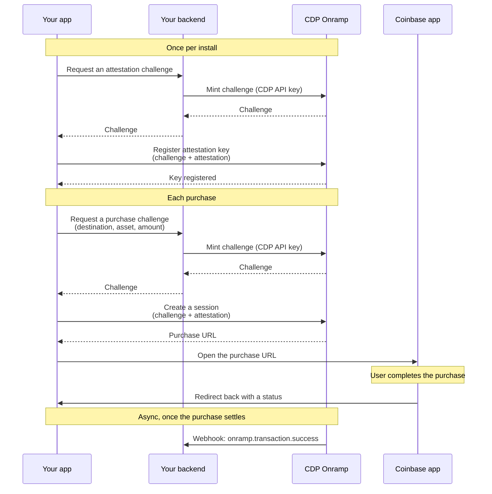

> Coinbase CDP docs — **onramp-offramp** · [index](../../README.md) · [all pages](../../MANIFEST.md)

# Overview

> Let users buy crypto without leaving your app by deep-linking them into the Coinbase app to complete the purchase.

**App2App turns your buy button into a deep link straight into the Coinbase app.** The user taps buy in your app, lands in Coinbase already signed in, confirms the purchase, and gets sent right back to you. Coinbase sends the crypto directly to the wallet address you specify, so there's no separate send step for the user to complete.

<Tip>
  **Why partners use App2App over a hosted checkout:**

  * **No messy logins in your app.** The user authenticates with Coinbase, not with your UI: no password fields, no OAuth redirects to build or maintain.
  * **Higher conversion.** Users who already have Coinbase skip account creation and payment entry entirely; they land on a purchase they can confirm in a couple of taps.
  * **A cleaner handoff.** Your app never touches a webview or an embedded checkout; it's a native deep link out and a native deep link back.
</Tip>

<Info>
  **Requires the Coinbase app.** App2App only works for users who have the Coinbase app installed, since that's what makes the deep-link handoff possible. If they don't have a Coinbase account yet, they can create one inline once they land in the app. Detecting whether the installed app supports App2App is covered in [setup](/onramp/app2app/setup).
</Info>

<Info>
  **Available for iOS today.** Android support isn't available yet. If you need to support Android, use [Coinbase-hosted Onramp](/onramp/coinbase-hosted-onramp/overview) instead.
</Info>

## How App2App differs from other integration options

<CardGroup cols={2}>
  <Card title="Coinbase-hosted Onramp" icon="browser" href="/onramp/coinbase-hosted-onramp/overview">
    Redirect users to a Coinbase-hosted page. Your backend authenticates with a CDP API key to create the session.
  </Card>

  <Card title="Headless Onramp" icon="mobile" href="/onramp/headless-onramp/overview">
    Embed an Apple Pay or Google Pay button directly in your app. Your backend authenticates with a CDP API key to create the order.
  </Card>
</CardGroup>

App2App is a third path, built specifically for mobile apps that want the purchase to happen **in the Coinbase app itself** rather than in a webview or an embedded button: your app proves itself with on-device attestation rather than a CDP API key, and the user is deep-linked into the Coinbase app to finish the purchase. Your backend still holds a CDP API key to mint challenges; see [why App2App uses device attestation](#why-app2app-uses-device-attestation) below.

## Payment methods and geographic availability

App2App doesn't maintain its own list of supported payment methods, countries, or limits. **Whatever the signed-in user's Coinbase account already supports (card, bank transfer, Apple Pay, their country, their limits) is exactly what's available to them through App2App.** There's nothing extra to configure and nothing narrower to work around: if Coinbase supports it for that user, App2App supports it too.

<Card title="Check availability by region" icon="globe" href="https://onramp-asset-availability.vercel.app/">
  Look up supported assets, networks, and payment methods for any region with the Onramp Asset Availability tool.
</Card>

## How it works

1. Your backend mints an attestation challenge (this is the one call in the whole flow that needs your CDP API key); your app registers an attestation key against it the first time it's installed.
2. For each purchase, your backend mints a purchase challenge the same way, then your app creates a session by proving the request came from your genuine app.
3. Your app opens the returned URL, which hands the user off to the Coinbase app to complete the purchase.
4. The Coinbase app sends the crypto to the destination you specified, then redirects the user back to your app.
5. Coinbase confirms settlement by sending your backend a webhook, which is the signal to trust, not the redirect.

See the [setup guide](/onramp/app2app/setup) for the full step-by-step, including the client-side App Attest calls and the two backend routes that mint challenges.

## Why App2App uses device attestation

Your app proves its identity using your platform's built-in attestation: **Apple App Attest** on iOS. This proves to Coinbase that the request came from your real, unmodified app running on a real device, not from a script or a copy of your app pretending to be you. Attestation is what lets the two unauthenticated calls (registration and session creation) trust the device without a CDP API key.

The other two calls, minting the attestation challenge and the purchase challenge, do require a CDP API key. That key has to live on your backend; it can never ship inside a mobile app. So App2App splits its four calls across two trust boundaries: your backend proves it's you with a CDP API key, and your app proves it's a genuine install with App Attest. See [setup](/onramp/app2app/setup) for exactly which calls go where.

You register an attestation key once per install, then re-prove your identity with a fresh signature for every purchase. Use `@coinbase/cdp-app-attest` directly to drive the App Attest ceremony (`attest()` for registration, `createAssertion()` per purchase); `@coinbase/cdp-react-native`'s `openCoinbaseOnramp()` doesn't support this two-backend-call model and isn't used in the setup guide.

## Get access

App2App is available to approved apps. To get your app enabled:

<Card title="Apply for Onramp Access" icon="file-pen" href="https://support.cdp.coinbase.com/onramp-onboarding">
  Contact the Coinbase team to get your app allowlisted for App2App. Then register your iOS App Attest identifier yourself in CDP Portal, under Payments → Onramp & Offramp → App2App iOS.
</Card>

## What to read next

* **[Setup](/onramp/app2app/setup):** Register your app, create sessions, and confirm settlement
* **[FAQ](/onramp/app2app/faq):** Common questions from partners integrating App2App
* **[Security Requirements](/onramp/security-requirements):** Domain allowlist requirements for your redirect URL
* **[Sandbox Testing](/onramp/app2app/setup#sandbox-testing):** Test your integration without moving real funds
