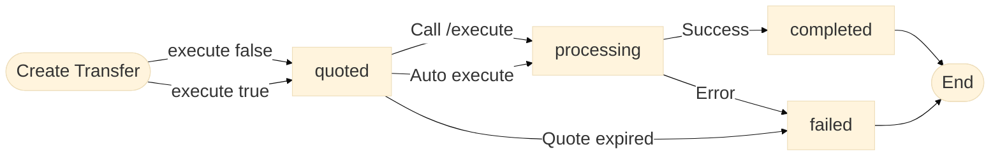

> Coinbase CDP docs — **payments** · [index](../../README.md) · [all pages](../../MANIFEST.md)

# Transfers

> Send payouts and disbursements from a custodial account to onchain addresses, email recipients, or bank accounts via fiat rails.

<Note>
  Transfers require a business account. If you're interested in using this product, [get in touch](https://www.coinbase.com/developer-platform/developer-interest) and our team will follow up to discuss fit.
</Note>

Transfers represent both the request and execution of a fund movement from a source to a target. They provide upfront fee quotes and track the complete lifecycle from initiation through completion or failure.

## Transfer types

| Transfer type | Source | Target | Typical use |
| - | - | - | - |
| Crypto withdrawal | Custodial account | External onchain address | Pay a customer, settle to chain |
| Email transfer | Custodial account | Coinbase user by email | Send USDC to a Coinbase user |
| Fiat withdrawal | Custodial account (USD) | Payment method (bank) | Fedwire/SWIFT/SEPA payout |
| Inbound deposit | External onchain address | Custodial account | Receive crypto (via deposit destination) |
| Account transfer | Custodial account | Custodial account | Treasury management |

## Lifecycle

Transfers move through a simple lifecycle from quote to execution outcome.



### Transfer statuses

| Status | Description | Recommended action |
| - | - | - |
| `quoted` | Transfer is quoted. May be a waiting state (`execute: false`) or transient before execution (`execute: true`). | If manual, call [Execute a Transfer](/api-reference/v2/rest-api/transfers/execute-transfer) before quote expiry. |
| `processing` | Transfer is executing. | No action needed; monitor via [Webhooks](/webhooks/transfers/overview). |
| `completed` | Transfer completed successfully. | No action needed. |
| `failed` | Failed due to execution error or quote expiry. | Inspect `failureReason`, review [Errors](/api-reference/v2/errors), then create a new transfer if needed. |

### Execution modes

| Mode | Behavior | When to use |
| - | - | - |
| `execute: true` | Transfer quotes then auto-executes | Most production flows |
| `execute: false` | Transfer remains in `quoted` until you call `/execute` | Show users fee quote before confirming |

## Fee quotes

Every transfer provides a comprehensive fee quote in the `fees` array before any money moves.

| Fee type | Description |
| - | - |
| `bank` | Traditional banking fees (e.g., wire transfer fees) |
| `conversion` | Asset conversion/exchange fees |
| `network` | Blockchain network fees (gas costs) |
| `other` | Other processing fees |

To review fees before execution:

1. Create a transfer with `execute: false`
2. Review the `fees` array in the response
3. Call `POST /v2/transfers/{transferId}/execute` when ready to proceed

```json theme={null}
{
  "fees": [
    { "type": "bank", "amount": "15.00", "asset": "usd" },
    { "type": "conversion", "amount": "1.00", "asset": "usd" },
    { "type": "network", "amount": "0.001", "asset": "eth" }
  ]
}
```

Fee quotes expire — the `expiresAt` field shows the deadline. If you use `execute: false`, you must call `/execute` before `expiresAt`.

## Amount types

The `amountType` field controls whether the given amount is sent from source or received at target:

| `amountType` | Behavior |
| - | - |
| `source` (default) | Target receives the amount minus fees |
| `target` | Target receives the exact amount; fees are added to the source amount |

**Example** — send exactly \$100 to recipient, fees paid by sender:

```json theme={null}
{
  "amount": "100.00",
  "amountType": "target"
}
```

## Supported rails and settlement times

| Transfer type | Rail | Asset | Typical settlement |
| - | - | - | - |
| Crypto withdrawal | Onchain | USDC, ETH, BTC, etc. | Minutes (network dependent) |
| Email transfer | Off-chain | USDC, USD | Instant |
| Fiat withdrawal | Fedwire | USD | Same day / next day |
| Fiat withdrawal | SWIFT | USD | 1–5 business days |
| Fiat withdrawal | SEPA | EUR | 1–2 business days |

## Exchange rate

For transfers involving currency conversion, the `exchangeRate` object provides rate information:

```json theme={null}
{
  "exchangeRate": {
    "sourceAsset": "usd",
    "targetAsset": "btc",
    "rate": "0.00001"
  }
}
```

The `rate` indicates how many units of the target asset equal one unit of the source asset.

## Estimated values

The `estimate` sub-object captures estimated values for transfers where amounts can't be guaranteed (e.g., USDC → EURC). The values in `estimate` are not modified after a transfer is executed — they are preserved as an immutable record of the original pre-execution snapshot. The actual executed values are populated in the `transfer` resource post-execution.

**Quoted state example** (USDC → EUR, rate not yet locked):

```json theme={null}
{
  "transferId": "transfer_af2937b0-9846-4fe7-bfe9-ccc22d935114",
  "status": "quoted",
  "source": {
    "accountId": "account_af2937b0-9846-4fe7-bfe9-ccc22d935114",
    "asset": "usdc"
  },
  "target": {
    "accountId": "account_bf3948c1-0957-5gf8-cef0-ddd33e046225",
    "asset": "eur"
  },
  "sourceAmount": "100.00",
  "sourceAsset": "usdc",
  "fees": [
    { "type": "conversion", "amount": "0.01", "asset": "usdc" }
  ],
  "estimate": {
    "exchangeRate": {
      "sourceAsset": "usdc",
      "targetAsset": "eur",
      "rate": "0.85"
    },
    "targetAmount": "85.00",
    "targetAsset": "eur",
    "fees": [
      { "type": "conversion", "amount": "0.01", "asset": "usdc" }
    ],
    "estimatedAt": "2026-01-01T00:00:00Z"
  },
  "expiresAt": "2026-01-01T00:00:10Z",
  "createdAt": "2026-01-01T00:00:00Z",
  "updatedAt": "2026-01-01T00:00:00Z"
}
```

**Completed state example** (actual rate differed slightly from estimate):

```json theme={null}
{
  "transferId": "transfer_af2937b0-9846-4fe7-bfe9-ccc22d935114",
  "status": "completed",
  "source": {
    "accountId": "account_af2937b0-9846-4fe7-bfe9-ccc22d935114",
    "asset": "usdc"
  },
  "target": {
    "accountId": "account_bf3948c1-0957-5gf8-cef0-ddd33e046225",
    "asset": "eur"
  },
  "sourceAmount": "100.00",
  "sourceAsset": "usdc",
  "targetAmount": "84.92",
  "targetAsset": "eur",
  "exchangeRate": {
    "sourceAsset": "usdc",
    "targetAsset": "eur",
    "rate": "0.8492"
  },
  "fees": [
    { "type": "conversion", "amount": "0.01", "asset": "usdc" }
  ],
  "estimate": {
    "exchangeRate": {
      "sourceAsset": "usdc",
      "targetAsset": "eur",
      "rate": "0.85"
    },
    "targetAmount": "85.00",
    "targetAsset": "eur",
    "fees": [
      { "type": "conversion", "amount": "0.01", "asset": "usdc" }
    ],
    "estimatedAt": "2026-01-01T00:00:00Z"
  },
  "completedAt": "2026-01-01T00:00:45Z",
  "executedAt": "2026-01-01T00:00:10Z",
  "createdAt": "2026-01-01T00:00:00Z",
  "updatedAt": "2026-01-01T00:00:45Z"
}
```

## Transfer validation

Use `validateOnly: true` to validate transfer parameters without creating a transfer. Useful for preflight checks.

<Note>
  `validateOnly` and `execute` are mutually exclusive. Setting both to `true` returns a `400` error.
</Note>

See [Transfer Validation](/payments/transfers/validation) for complete request/response examples, validation errors, and sandbox guidance.

## Outcomes

### Completion

When a transfer reaches `completed` status, it contains the final execution details:

* `completedAt` — When the transfer finished
* `executedAt` — When the transfer moved from `quoted` to `processing`
* `targetAmount` — The actual amount delivered to the target
* `details` — Additional information (e.g., deposit destination reference)

```json theme={null}
{
  "transferId": "transfer_af2937b0-9846-4fe7-bfe9-ccc22d935114",
  "status": "completed",
  "source": {
    "address": "0x833589fCD6eDb6E08f4c7C32D4f71b54bdA02913",
    "network": "base",
    "asset": "usdc"
  },
  "target": {
    "accountId": "account_af2937b0-9846-4fe7-bfe9-ccc22d935114",
    "asset": "usdc"
  },
  "sourceAmount": "100.00",
  "sourceAsset": "usdc",
  "targetAmount": "100.00",
  "targetAsset": "usdc",
  "completedAt": "2026-01-01T00:05:00Z",
  "executedAt": "2026-01-01T00:01:30Z",
  "createdAt": "2026-01-01T00:00:00Z",
  "updatedAt": "2026-01-01T00:05:00Z",
  "details": {
    "depositDestination": {
      "id": "depositDestination_af2937b0-9846-4fe7-bfe9-ccc22d935114"
    },
    "onchainTransactions": [
      {
        "transactionHash": "0x363cd3b3d4f49497cf5076150cd709307b90e9fc897fdd623546ea7b9313cecb",
        "network": "base"
      }
    ]
  }
}
```

### Failure

When a transfer fails, the `failureReason` field contains a human-readable description of what went wrong.

A transfer can reach `failed` status in two ways:

* **Execution error** — the transfer was executing and encountered an error (e.g., insufficient balance, network failure).
* **Quote expiration** — the transfer was in `quoted` status and the fee quote expired before `/execute` was called. Create a new transfer to get a fresh quote.

```json theme={null}
{
  "status": "failed",
  "failureReason": "Insufficient balance to complete this transfer."
}
```

## Travel rule

For transfers requiring travel rule compliance, include the `travelRule` object with originator and beneficiary details.

| Field | Description |
| - | - |
| `isSelf` | Whether the receiving wallet belongs to the sender |
| `isIntermediary` | Whether Coinbase is acting as an intermediary VASP |
| `originator` | Information about the sender (name, address, VASP details) |
| `beneficiary` | Information about the receiver (name, address, wallet type) |

Set `isIntermediary: true` when your organization is a VASP using Coinbase to send crypto on behalf of your end customer. You must then provide the `originator` object with the sender's details and your VASP information.

```json theme={null}
{
  "travelRule": {
    "isSelf": false,
    "isIntermediary": true,
    "originator": {
      "name": "John Doe",
      "address": {
        "line1": "123 Main St",
        "city": "San Francisco",
        "postCode": "94105",
        "countryCode": "US"
      },
      "virtualAssetServiceProvider": {
        "name": "Your VASP Name",
        "identifier": "5493001KJTIIGC8Y1R17"
      }
    },
    "beneficiary": {
      "name": "Jane Smith",
      "walletType": "custodial"
    }
  }
}
```

## Webhooks

Subscribe to `payment.transfer.*` events to receive real-time status updates as transfers move through their lifecycle. See [Webhooks](/webhooks/transfers/overview) for setup instructions.

## Next steps

<CardGroup cols={2}>
  <Card title="Quickstart" icon="rocket" href="/payments/transfers/quickstart">
    Create your first transfer in Sandbox
  </Card>

  <Card title="Example payloads" icon="file-code" href="/payments/transfers/example-payloads">
    Payload shapes for each source/target type
  </Card>

  <Card title="Validation" icon="check" href="/payments/transfers/validation">
    Preflight checks and validation errors
  </Card>

  <Card title="Webhooks" icon="webhook" href="/webhooks/transfers/overview">
    Subscribe to transfer status events
  </Card>
</CardGroup>
