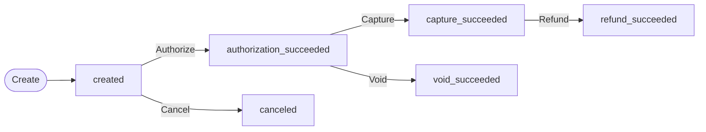

> Coinbase CDP docs — **payments** · [index](../../README.md) · [all pages](../../MANIFEST.md)

# Payment Acceptance

> Best-in-class stablecoin payment acceptance — reach 150M+ stablecoin holders and let them pay from any wallet or their Coinbase account, in USDC or USDT, with no gas fees.

Payment Acceptance is a full, enterprise-grade payments stack — not just transfers. Authorizations, captures, refunds, voids, disbursements, and fiat settlement — the same primitives your systems already use for cards, built for stablecoins. Increase conversion and tap a global customer base you can't reach today.

## Choose your integration

Both paths give your buyers the same experience — pay with any wallet, any supported chain, and no gas fees. The difference is how much control you need over the payment lifecycle.

<CardGroup cols={2}>
  <Card title="Coinbase Business" icon="bolt">
    Start accepting payments in hours — self-serve, hosted checkout, settlement with bank offramps.

    Best for: businesses accepting payments directly.
  </Card>

  <Card title="Payment Acceptance" icon="sliders">
    Full control over the payment lifecycle — auth, capture, void, refund, fee splits, embeddable checkout.

    Best for: PSPs, marketplaces, and enterprise platforms.
  </Card>
</CardGroup>

| | **Coinbase Business** | **Payment Acceptance** |
| - | - | - |
| **Onboarding** | Self-serve, start in hours | Enhanced due diligence, \~1 month |
| **Integration** | Dashboard UI + API | API-only, embeddable web component available |
| **Payment flow** | Create checkout/invoice/payment link, get a hosted URL | Create session, authorize, capture, void, refund |
| **Control** | Coinbase manages the lifecycle | You control auth, capture timing, partial captures, voids |
| **Fee configuration** | Standard pricing | Configurable fee splits, custom billing models |
| **Settlement** | To your Coinbase account, with bank offramps | Configurable — Fedwire, SWIFT, USDC |
| **Buyer experience** | Hosted payment page | Hosted page, redirect, or embeddable web component |
| **Get started** | [Sign up and start building](/coinbase-business/checkout-apis/overview) | [Contact our team](mailto:coinbase.payments@coinbase.com) |

***

## Payment Acceptance

> Full-lifecycle stablecoin payment APIs for PSPs, marketplaces, and enterprise platforms.

<Note>
  Payment Acceptance requires onboarding with our team. [Get in touch](mailto:coinbase.payments@coinbase.com) to start the process.
</Note>

Payment Acceptance gives you the same stablecoin checkout experience that powers Coinbase Business, with full control over the payment lifecycle. Authorization, capture, void, and refund work like the card networks your systems already support. Configure expiries, split fees, embed the checkout in your own UI, and settle to your bank on your schedule.

## Why stablecoins

* **A customer base you can't reach today.** Over 150 million people hold stablecoins globally.
* **Borderless by default.** Buyers pay from anywhere in the world, 24/7. No cross-border fees, no FX conversion, no correspondent banking.
* **Coinbase as a payment method.** Buyers pay from their Coinbase account or any major self-custody wallet (500+ supported) — so you capture both Coinbase's customers and the rest of the stablecoin market.
* **No gas fees.** Buyers pay the exact amount at checkout, nothing more.

## What you get

* **Standard payment primitives.** Authorization, capture, void, and refund. Partial captures and partial refunds. Configurable expiry deadlines for each stage.
* **Reach the whole market.** Buyers pay from their Coinbase account or any major self-custody wallet — MetaMask, Trust Wallet, Base Pay, and hundreds more — or through an x402-enabled agent. Ethereum, Base, Arbitrum, Optimism, Polygon.
* **No gas fees for buyers.** Buyers pay the exact amount at checkout, nothing more.
* **Configurable settlement.** Settle in USD or USDC in seconds, not days — automated bank sweeps, custom billing models, transaction-level reporting and reconciliation files.
* **Multiple buyer experiences.** Hosted payment page, redirect flow, or embeddable web component for your own UI.
* **Disbursements.** Send funds to Coinbase accounts or onchain addresses for credits, rebates, and goodwill payouts independent of any payment session.
* **Recurring payments.** Customers approve once from their own wallet, then you authorize payments on your schedule for subscriptions, usage-based billing, and auto top-ups. No fresh signature per payment, and no gas fees.
* **Agentic-ready out of the box.** Native x402 support means AI agents can pay through the same APIs — every agent can already pay, no extra integration.

## Payment lifecycle

A payment session tracks the full lifecycle from creation through settlement.

**Typical flow:** Create a payment session, the buyer authorizes the payment, you capture the funds after fulfillment, and the funds settle to your account.

| Step | What happens | API |
| - | - | - |
| **Create** | Define amount, asset, and settlement target | `POST /v2/payment-sessions` |
| **Authorize** | Buyer approves payment from their wallet, Coinbase account, or x402-enabled agent, or you authorize with a [mandate](/payments/payment-acceptance/recurring-payments) the buyer approved earlier | `POST .../authorizations/wallet`, `.../coinbase`, `.../x402`, or `.../mandate` |
| **Capture** | Collect authorized funds — full or partial | `POST .../captures` |
| **Void** | Release uncaptured funds back to the buyer | `POST .../voids` |
| **Refund** | Return captured funds to the buyer | `POST .../refunds` |

### Capture modes

| Mode | Behavior | When to use |
| - | - | - |
| **Auto-capture** (`autoCapture: true`) | Capture is created automatically after authorization succeeds | Instant delivery — digital goods, subscriptions, top-ups |
| **Manual capture** (`autoCapture: false`) | You call the captures endpoint when ready | Delayed fulfillment — physical goods, marketplace payouts |

With manual capture, you can capture in multiple parts. Set `finalCapture: true` on the last capture to release remaining authorized funds back to the buyer.

## Payment session statuses

| Status | Description | Recommended action |
| - | - | - |
| `created` | Awaiting buyer authorization | Present payment UI to buyer |
| `canceled` | Canceled before authorization | No action needed |
| `authorization_pending` | Authorization in progress | Wait for webhook |
| <code style={{whiteSpace: "nowrap"}}>authorization\_succeeded</code> | Funds held, ready to capture | Capture after fulfillment |
| `authorization_failed` | Authorization failed | Inspect error, create new session if needed |
| `capture_pending` | Capture in progress | Wait for webhook |
| `capture_succeeded` | Funds captured and settled | No action needed |
| `capture_failed` | Capture failed | Inspect error, retry capture |
| `void_pending` | Void in progress | Wait for webhook |
| `void_succeeded` | Uncaptured funds released to buyer | No action needed |
| `refund_pending` | Refund in progress | Wait for webhook |
| `refund_succeeded` | Captured funds returned to buyer | No action needed |
| `refund_failed` | Refund failed | Inspect error, retry refund |

## Authorization flows

| Flow | How it works | Use case |
| - | - | - |
| **Wallet** | Buyer connects a self-custody wallet and signs cryptographic payloads | Web checkout with MetaMask, Trust Wallet, Base Pay, and 500+ wallets |
| **Coinbase** | Buyer authorizes via Coinbase OAuth | Pay with Coinbase balance — enterprise partners with OAuth integration |
| **x402** | HTTP-native payment via `PAYMENT-SIGNATURE` header | Machine-to-machine payments, API monetization |
| **Mandate** | You authorize a payment from a wallet the buyer approved earlier, with no fresh signature | Subscriptions, usage-based billing, auto top-ups. See [Recurring Payments](/payments/payment-acceptance/recurring-payments) |

Payment sessions created with a wallet target also include an `x402Url` — a CDP-hosted URL you can give directly to an x402-enabled agent. See [Payment Sessions](/payments/payment-acceptance/payment-sessions) for details on this field, and [Authorization](/payments/payment-acceptance/authorization) for how the x402 flow works end to end.

## Balances

Every payment session tracks running totals as funds move through the lifecycle:

| Balance | Description |
| - | - |
| `capturable` | Authorized funds not yet captured or voided |
| `captured` | Total funds captured |
| `refundable` | Captured funds not yet refunded |
| `refunded` | Total funds refunded |

Multiple partial captures are allowed up to the authorized amount. Multiple partial refunds are allowed up to the captured amount.

## Next steps

<CardGroup cols={2}>
  <Card title="Quickstart" icon="rocket" href="/payments/payment-acceptance/quickstart">
    Create your first payment session in Sandbox
  </Card>

  <Card title="Payment Sessions" icon="rectangle-history" href="/payments/payment-acceptance/payment-sessions">
    Expiries, balances, auto-capture, and target types
  </Card>

  <Card title="Authorization" icon="shield-check" href="/payments/payment-acceptance/authorization">
    Wallet, Coinbase, and x402 authorization flows
  </Card>

  <Card title="Recurring Payments" icon="arrows-rotate" href="/payments/payment-acceptance/recurring-payments">
    Approve once, get paid on your schedule
  </Card>

  <Card title="Hosted Checkout" icon="credit-card" href="/payments/payment-acceptance/hosted-checkout">
    Redirect flow and the embeddable web component
  </Card>

  <Card title="API Reference" icon="code" href="/api-reference/v2/rest-api/payment-sessions/payment-sessions">
    Full Payment Acceptance API
  </Card>
</CardGroup>

## Who this is for

Payment Acceptance is designed for payment service providers, marketplaces, and large-scale commerce platforms looking to add stablecoin checkout as a payment method.

## Get in touch

If you're interested in adding stablecoin payments to your platform, email us at [coinbase.payments@coinbase.com](mailto:coinbase.payments@coinbase.com).

Tell us about your business and we'll follow up to discuss fit.
