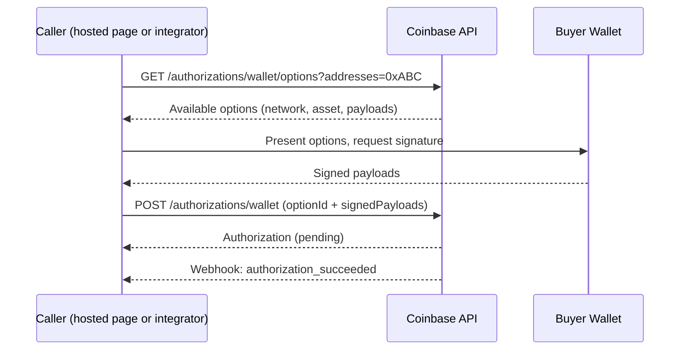

> Coinbase CDP docs — **payments** · [index](../../README.md) · [all pages](../../MANIFEST.md)

# Authorization

> Wallet, Coinbase, x402, and mandate authorization flows for Payment Acceptance.

Authorization places a hold on the buyer's funds. Once authorized, you can capture (collect) the funds. Only one authorization is allowed per session.

Payment Acceptance supports four authorization methods. All are asynchronous — the authorization is returned in `pending` status and transitions to `succeeded` or `failed`.

<Note>
  You only need these APIs if you're building the checkout yourself. If you use Coinbase's hosted payment page or redirect flow, Coinbase handles the entire authorization flow (wallet connection, option resolution, signing, and submission) — you don't need to implement anything on this page. Call these endpoints directly only when you're embedding the checkout in your own UI or building an agentic (machine-to-machine) integration.
</Note>

## Wallet authorization

The buyer connects a self-custody wallet and signs cryptographic payloads to authorize the payment. Supports 500+ EVM-compatible wallets including MetaMask, Trust Wallet, Base Pay, Rabby, and more.

### How it works



<Note>
  When Coinbase's hosted page drives this flow, it passes every address the connected wallet controls, and Coinbase resolves the best funding option per asset across them.
</Note>

### Step 1: Get wallet authorization options

Pass one or more buyer wallet addresses to get available payment options. Each option specifies the network, asset, amount, and payloads the buyer must sign.

```bash theme={null}
cdp api /platform/v2/payment-sessions/$SESSION_ID/authorizations/wallet/options \
  -e sandbox \
  addresses==0xAbC1234567890aBcDeF1234567890AbCdEf123456
```

You can provide up to 5 addresses (comma-separated) and optionally filter by `network` or `asset`. Coinbase returns at most one option per asset, selected across all supplied addresses — addresses that aren't chosen are omitted from the response (for example, because they have insufficient funds or a better-funded address was selected instead):

```
?addresses=0xABC,0xDEF&network=base&asset=usdc
```

The response contains one or more options, each with payloads the buyer must process:

```json theme={null}
{
  "options": [
    {
      "optionId": "opt_a1b2c3d4-e5f6-7890-abcd-ef1234567890",
      "source": {
        "address": "0xAbC1234567890aBcDeF1234567890AbCdEf123456",
        "network": "base",
        "asset": "usdc"
      },
      "amount": "25.00",
      "asset": "usdc",
      "network": "base",
      "payloads": [
        {
          "payloadId": "payload_af2937b0-...",
          "type": "eip3009",
          "data": { ... }
        }
      ]
    }
  ]
}
```

<Note>
  This is a stateless read — the session is not modified. If a requested address has no eligible options, it is simply absent from the response.
</Note>

### Payload types

Each option includes payloads the buyer must sign or submit. The `type` field tells you how to handle the `data`:

| Type | Action | Returns |
| - | - | - |
| `eip3009` | Pass `data` to `eth_signTypedData_v4` | Hex-encoded signature |
| `permit2` | Pass `data` to `eth_signTypedData_v4` | Hex-encoded signature |
| `spend_permission` | Pass `data` to `eth_signTypedData_v4` | Hex-encoded signature |
| `erc20_approval` | Send `data` via `eth_sendTransaction` | Transaction hash |

### Step 2: Submit signed payloads

After the buyer signs, submit the signed payloads with the selected option ID:

```bash theme={null}
cdp api -X POST /platform/v2/payment-sessions/$SESSION_ID/authorizations/wallet \
  -e sandbox \
  optionId=opt_a1b2c3d4-e5f6-7890-abcd-ef1234567890 \
  'signedPayloads:=[{"payloadId":"payload_af2937b0-...","signature":"0xabcdef..."}]'
```

The authorization is returned in `pending` status. Subscribe to webhooks to know when it transitions to `succeeded` or `failed`.

## Coinbase authorization

The buyer authorizes the payment using their Coinbase account via OAuth. This flow is for enterprise partners with Coinbase OAuth integration (e.g., Pay with Coinbase).

```bash theme={null}
curl -X POST \
  https://sandbox.cdp.coinbase.com/platform/v2/payment-sessions/$SESSION_ID/authorizations/coinbase \
  -H "Authorization: Bearer $COINBASE_OAUTH_TOKEN" \
  -H "Content-Type: application/json"
```

<Note>
  This endpoint requires OAuth authentication (the buyer's Coinbase bearer token), not API key authentication. It cannot be called with `cdp api`, which authenticates with your CDP API key. The buyer must have previously connected their Coinbase account via OAuth.
</Note>

```json theme={null}
{
  "authorizationId": "authorization_82c879c1-...",
  "paymentSessionId": "paymentSession_82c879c1-...",
  "status": "pending",
  "amount": "25.00",
  "source": {
    "coinbaseUserId": "coinbase_user_abc123"
  },
  "createdAt": "2026-05-16T12:01:00.000Z",
  "updatedAt": "2026-05-16T12:01:00.000Z"
}
```

If `autoCapture` is enabled on the session, a capture is automatically created after authorization succeeds.

## x402 authorization

x402 is an HTTP-native payment protocol. The buyer submits a base64-encoded payment payload in the `PAYMENT-SIGNATURE` header. Designed for machine-to-machine payments and API monetization.

```bash theme={null}
curl -X POST \
  https://api.cdp.coinbase.com/platform/v2/payment-sessions/$SESSION_ID/authorizations/x402 \
  -H "PAYMENT-SIGNATURE: eyJ4NDAyVmVyc2lvbi..." \
  -H "Content-Type: application/json"
```

### 402 Payment Required

If the `PAYMENT-SIGNATURE` header is missing or invalid, the API returns `402 Payment Required` with a `PAYMENT-REQUIRED` header describing accepted payment parameters:

```
HTTP/1.1 402 Payment Required
PAYMENT-REQUIRED: eyJ4NDAyVmVyc2lvbi...
```

The `PAYMENT-REQUIRED` header is base64-encoded and contains accepted networks, assets, amounts, and payment addresses.

### Successful x402 authorization

On success, the response includes a `PAYMENT-RESPONSE` header and a `message` field:

```json theme={null}
{
  "authorizationId": "authorization_82c879c1-...",
  "status": "pending",
  "amount": "1.00",
  "message": "Your payment was successfully submitted",
  "source": {
    "address": "0xAbC1234567890aBcDeF1234567890AbCdEf123456",
    "network": "base",
    "asset": "usdc"
  }
}
```

## Mandate authorization

A mandate is a customer's one-time approval for you to pull payments from their wallet later, within spending limits you set. Authorizing with a mandate needs no fresh signature, so the customer doesn't need to be present. Use it for subscriptions, usage-based billing, and auto top-ups.

Unlike the other methods, you always call this endpoint yourself, authenticated with your API key:

```bash theme={null}
cdp api -X POST /platform/v2/payment-sessions/$SESSION_ID/authorizations/mandate -e sandbox \
  "Header:X-Idempotency-Key:8e03978e-40d5-43e8-bc93-6894a57f9324" \
  mandateId=mandate_82c879c1-84e1-44ed-a8c2-1ac239cf09ad
```

```json theme={null}
{
  "authorizationId": "authorization_93d980d2-95f2-55fe-b9d3-2bd340cf10be",
  "paymentSessionId": "paymentSession_82c879c1-84e1-44ed-a8c2-1ac239cf09ad",
  "status": "pending",
  "amount": "19.99",
  "source": {
    "address": "0xAbC1234567890aBcDeF1234567890AbCdEf123456",
    "network": "base",
    "asset": "usdc"
  },
  "mandateId": "mandate_82c879c1-84e1-44ed-a8c2-1ac239cf09ad",
  "createdAt": "2026-07-01T09:30:00.000Z",
  "updatedAt": "2026-07-01T09:30:00.000Z"
}
```

The mandate must be approved and the amount must fit within its spending limits. See [Recurring Payments](/payments/payment-acceptance/recurring-payments) to create a mandate, get the customer's approval, and handle mandate errors.

## Authorization outcomes

### Success

When authorization succeeds:

* Session status moves to `authorization_succeeded`
* `balances.capturable` equals the authorized amount
* `source` is set on the session (buyer's wallet address or Coinbase account)
* If `autoCapture` is enabled, a capture is automatically created

### Failure

When authorization fails:

* Session status moves to `authorization_failed`
* The `error` object on the authorization contains a `code` and `message`
* Authorization endpoints require the session to be in `created` status, so this session can't be re-authorized — create a new payment session before retrying

Common failure reasons:

| Error code | Description |
| - | - |
| `insufficient_funds` | Buyer does not have enough funds |
| `authorization_expired` | The session's `authorizationExpiresAt` deadline has passed |
| `invalid_signature` | The wallet signature is invalid |

## Idempotency

All authorization endpoints accept an `X-Idempotency-Key` header. Use a UUID v4 to safely retry requests:

```bash theme={null}
cdp api -X POST /platform/v2/payment-sessions/$SESSION_ID/authorizations/wallet \
  -e sandbox \
  "Header:X-Idempotency-Key:8e03978e-40d5-43e8-bc93-6894a57f9324" \
  optionId=opt_... \
  'signedPayloads:=[...]'
```

Duplicate requests with the same key return identical responses.

## Related

<CardGroup cols={2}>
  <Card title="Payment Sessions" icon="rectangle-history" href="/payments/payment-acceptance/payment-sessions">
    Session lifecycle, expiries, and balances
  </Card>

  <Card title="Webhooks" icon="webhook" href="/webhooks/payment-acceptance/overview">
    Get notified when authorization succeeds or fails
  </Card>

  <Card title="Recurring Payments" icon="arrows-rotate" href="/payments/payment-acceptance/recurring-payments">
    Create mandates and authorize payments on your schedule
  </Card>

  <Card title="API Reference - Wallet Auth" icon="wallet" href="/api-reference/v2/rest-api/payment-sessions/authorize-a-payment-session-with-a-wallet">
    Wallet authorization API
  </Card>

  <Card title="API Reference - Coinbase Auth" icon="coins" href="/api-reference/v2/rest-api/payment-sessions/authorize-a-payment-session-with-a-coinbase-account">
    Coinbase authorization API
  </Card>
</CardGroup>
