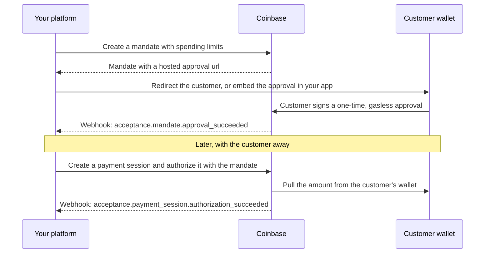

> Coinbase CDP docs — **payments** · [index](../../README.md) · [all pages](../../MANIFEST.md)

# Recurring Payments

> Accept recurring payments and merchant-initiated transactions from a customer's self-custody wallet after a single approval. Built for subscriptions, usage-based billing, and repeat purchases in stablecoins.

Recurring payments, also known as **merchant-initiated transactions (MITs)**, let a customer approve once from their own wallet, then let you authorize payments later without asking again. The customer keeps their funds in their wallet until you authorize a payment. Each payment is a normal payment session, so capture, void, refund, webhooks, and settlement work exactly as they do for every other Payment Acceptance payment.

The approval is called a **mandate**: the customer's revocable consent for you to pull payments from their wallet, within limits you set.

## What you can build

<CardGroup cols={2}>
  <Card title="Subscriptions" icon="arrows-rotate">
    Bill monthly or annual plans without sending the customer back to checkout every cycle.
  </Card>

  <Card title="Usage-based billing" icon="gauge">
    Bill for metered usage at the end of each billing period, for any amount within your limits.
  </Card>

  <Card title="Auto top-ups" icon="battery-half">
    Refill a prepaid balance or credits automatically when it runs low.
  </Card>

  <Card title="One-click repeat purchases" icon="bolt">
    Let returning customers pay without connecting a wallet and signing again.
  </Card>
</CardGroup>

## Why recurring payments

* **One approval, many payments.** The customer signs once. You authorize payments whenever your billing logic says so.
* **Customers keep custody.** Funds stay in the customer's wallet until a payment pulls them. Nothing is prefunded or locked up.
* **No gas fees for customers.** Approving is gasless and so is every payment. Customers pay the exact amount, nothing more.
* **The lifecycle you already built.** Each payment is a payment session. Capture, void, refund, webhooks, and reporting don't change.
* **Pay from any supported network.** Customers approve from Base, Ethereum, Arbitrum, Optimism, or Polygon. Every payment settles the same way as other wallet payments.
* **Customers stay in control.** Every mandate has spending limits, and customers can remove their approval at any time.

## How it works



<Steps>
  <Step title="Create a mandate">
    Call `POST /v2/mandates` with the spending limits for this customer.
  </Step>

  <Step title="The customer approves once">
    Send the customer to Coinbase's hosted approval page, or embed it in your app. They connect their self-custody wallet and sign a single gasless approval.
  </Step>

  <Step title="Get paid on your schedule">
    For each payment, create a payment session and authorize it with the `mandateId`. The customer doesn't need to be present.
  </Step>
</Steps>

## 1. Create a mandate

Create one mandate per customer relationship, such as one per subscription. Set spending limits that fit your billing model.

```bash theme={null}
cdp api -X POST /platform/v2/mandates -e sandbox \
  asset=usdc \
  policy.maxPerAuthorization=50.00 \
  policy.maxPerPeriod.amount=100.00 \
  policy.maxPerPeriod.period=month \
  metadata.customer_id=cust_12345
```

| Field | Description |
| - | - |
| `asset` | The stablecoin the spending limits are denominated in, such as `usdc`. |
| `policy` | Spending limits. Optional. See [Spending limits](#spending-limits). |
| `expiresAt` | Optional date after which you can no longer authorize payments with the mandate. Omit for no expiry. |
| `metadata` | Up to 10 key-value pairs, such as your customer or subscription ID. |

<Accordion title="Example response">
  ```json theme={null}
  {
    "mandateId": "mandate_82c879c1-84e1-44ed-a8c2-1ac239cf09ad",
    "asset": "usdc",
    "policy": {
      "maxPerAuthorization": "50.00",
      "maxPerPeriod": {
        "amount": "100.00",
        "period": "month"
      }
    },
    "status": "created",
    "url": "https://payments.coinbase.com/mandates/mandate_82c879c1-84e1-44ed-a8c2-1ac239cf09ad",
    "metadata": {
      "customer_id": "cust_12345"
    },
    "createdAt": "2026-06-15T12:00:00.000Z",
    "updatedAt": "2026-06-15T12:00:00.000Z"
  }
  ```
</Accordion>

Coinbase generates the `mandateId`. You can't set it yourself, so save it with your customer record. You'll need it to authorize every payment. To attach your own identifiers, such as a customer or subscription ID, use `metadata`.

```bash theme={null}
export MANDATE_ID="mandate_82c879c1-84e1-44ed-a8c2-1ac239cf09ad"
```

The mandate starts in `created` status. You can't authorize payments with it until the customer approves it.

## 2. Get the customer's approval

The customer approves the mandate once from their self-custody wallet, for example during signup or checkout.

Redirect the customer to the mandate's `url`, or embed the approval in your page by calling `render({ mandateId })` on the `<coinbase-payment>` web component. Coinbase connects the wallet, picks the best-funded network, and collects the signature. See [Hosted Checkout](/payments/payment-acceptance/hosted-checkout#mandate-approval-and-revocation) for setup.

The approval returns in `pending` status and confirms onchain shortly after. Wait for the `acceptance.mandate.approval_succeeded` webhook before you authorize a payment. At that point the mandate moves to `approval_succeeded` and its `source` shows the wallet address and network the customer approved from. If approval fails, the mandate moves to `approval_failed` and the customer can try again.

<Accordion title="Build your own approval UI">
  You only need these endpoints if you're not using the hosted page or embedded component. They don't use your API key, because the customer's wallet signature is the proof of consent, so you can call them from your frontend. The flow mirrors [wallet authorization](/payments/payment-acceptance/authorization#wallet-authorization).

  1. Get approval options for one to five of the customer's wallet addresses:

     ```bash theme={null}
     curl "https://sandbox.cdp.coinbase.com/platform/v2/mandates/$MANDATE_ID/approvals/wallet/options?addresses=0xAbC1234567890aBcDeF1234567890AbCdEf123456"
     ```

     Coinbase returns at most one option, choosing the address and network with the highest stablecoin balance. Addresses that can't be used appear in `ineligibleAddresses` with a reason, such as `insufficient_funds`.

  2. Pass the option's `eip2612` payload `data` to `eth_signTypedData_v4` in the customer's wallet.

  3. Submit the signature:

     ```bash theme={null}
     curl -X POST "https://sandbox.cdp.coinbase.com/platform/v2/mandates/$MANDATE_ID/approvals/wallet" \
       -H "Content-Type: application/json" \
       -d '{
         "optionId": "opt_a1b2c3d4-e5f6-7890-abcd-ef1234567890",
         "signedPayloads": [
           { "payloadId": "payload_af2937b0-...", "signature": "0xabcdef..." }
         ]
       }'
     ```

  Sign and submit payloads from a single options response. Each response includes a fresh nonce and deadline, so don't cache options.

  Revocation works the same way: call `GET /v2/mandates/{mandateId}/revocations/wallet/options`, have the customer sign the returned `eip2612` payload, and submit the signature to `POST /v2/mandates/{mandateId}/revocations/wallet`.
</Accordion>

## 3. Authorize a payment

For each payment, [create a payment session](/payments/payment-acceptance/payment-sessions) for the amount due, then authorize it with the mandate. The customer doesn't need to take any action.

```bash theme={null}
cdp api -X POST /platform/v2/payment-sessions -e sandbox \
  amount=19.99 \
  asset=usdc \
  target.accountId=$ACCOUNT_ID \
  target.asset=usd \
  'autoCapture:=true' \
  externalReferenceId=invoice-2026-07

cdp api -X POST /platform/v2/payment-sessions/$SESSION_ID/authorizations/mandate -e sandbox \
  "Header:X-Idempotency-Key:8e03978e-40d5-43e8-bc93-6894a57f9324" \
  mandateId=$MANDATE_ID
```

The authorization returns in `pending` status and moves to `succeeded` or `failed`. From there the session follows the [standard lifecycle](/payments/payment-acceptance/overview#payment-lifecycle):

* **Auto-capture** suits most recurring payments, because you've already delivered the service or are about to.
* **Voids and refunds** always return funds to the wallet and network the customer approved from.
* **Idempotency keys** let you retry an authorization safely. Always send `X-Idempotency-Key` from your billing jobs so a retry never pulls funds twice.

An authorization is rejected before any funds move if the mandate isn't usable or the amount breaks the spending limits. See [Errors](#errors).

## Spending limits

Every mandate has a `policy` that caps what you can authorize. Coinbase checks the policy on every authorization.

| Limit | What it caps |
| - | - |
| <code style={{whiteSpace: "nowrap"}}>maxPerAuthorization</code> | The largest single authorization. |
| `maxPerPeriod` | The total you can authorize in a rolling `day`, `week`, `month`, or `year`. Windows are measured back from now, so `month` means the trailing 30 days, not the calendar month. |
| `minSetupBalance` | The minimum stablecoin balance the customer needs to approve the mandate. Customers always need at least \$1. Set a higher value to require more. It doesn't affect payment amounts. |

All limits are optional. Any limit you omit gets a Coinbase default, and limits above Coinbase's maximums are lowered to the maximum. The response always shows the limits that apply. An authorization over a limit is rejected with `422 mandate_policy_violation`, and no funds move.

We recommend setting your own limits that match your billing model. Your business is responsible for payments authorized with its mandates, so tight limits protect your customers from misuse. Leave some headroom above your expected payment amounts for plan upgrades, taxes, or usage spikes. Mandate terms can't be edited after you create the mandate. To change them, cancel the mandate, create a new one, and ask the customer to approve it.

## Ending a mandate

There are two ways to end a mandate, and they're independent.

| | Cancel | Revoke |
| - | - | - |
| **Who** | You | The customer |
| **How** | `POST /v2/mandates/{mandateId}/cancel` | The hosted `revocationUrl` or embedded component, or directly from their wallet |
| **Effect** | Blocks new authorizations immediately. Authorizations already in progress aren't affected. | Removes the onchain approval from the customer's wallet |
| **Timing** | Instant | Confirms onchain shortly after the customer signs |

When a customer ends their subscription, cancel the mandate so no further payments can be authorized, and point them to `revocationUrl` if they also want to remove the wallet approval. If a customer removes the approval directly from their wallet, your next authorization fails.

```bash theme={null}
cdp api -X POST /platform/v2/mandates/$MANDATE_ID/cancel -e sandbox \
  reason="Customer canceled their subscription."
```

## Mandate statuses

`status` reflects the most recent action on the mandate.

| Status | Meaning |
| - | - |
| `created` | Waiting for the customer to approve. |
| `approval_pending` | Approval is confirming onchain. |
| `approval_succeeded` | Approved. You can authorize payments with it. |
| `approval_failed` | The last approval attempt failed. The customer can try again. |
| `canceled` | You canceled it. No further authorizations. |
| `revocation_pending` | The customer's revocation is confirming onchain. |
| `revocation_succeeded` | The customer removed their approval. No further authorizations. |
| `revocation_failed` | The revocation didn't complete. The approval is still in place. |

To decide whether you can authorize a payment with a mandate, check its timestamps rather than relying on `status` alone. A mandate is usable when `approvedAt` is set, `canceledAt` and `revokedAt` are empty, `expiresAt` is empty or in the future, and no revocation is in progress (`status` isn't `revocation_pending`). For example, a mandate in `revocation_failed` is still usable because the approval was never removed.

## Webhooks

Subscribe to `acceptance.mandate.*` events to track approvals and cancellations. Payments authorized with a mandate use the existing [payment session events](/webhooks/payment-acceptance/overview#payment-session-events).

| Event | Fires when |
| - | - |
| `acceptance.mandate.created` | You create a mandate |
| `acceptance.mandate.approval_initiated` | The customer signs and approval starts confirming |
| `acceptance.mandate.approval_succeeded` | The mandate is approved and ready to use |
| `acceptance.mandate.approval_failed` | Approval failed. The customer can retry |
| `acceptance.mandate.canceled` | You cancel the mandate |
| `acceptance.mandate.revocation_initiated` | The customer signs a revocation |
| `acceptance.mandate.revocation_succeeded` | The approval is removed from the customer's wallet |
| `acceptance.mandate.revocation_failed` | Revocation failed. The customer can retry |

Every mandate event's `data` contains the full `mandate`. Approval events also include `approval`, and revocation events include `revocation`, each with an `error` when the attempt fails. See [example payloads](/webhooks/payment-acceptance/example-payloads) and [Webhooks](/webhooks/payment-acceptance/overview) for setup.

## Errors

These errors mean Coinbase rejected a mandate authorization before any funds moved. Coinbase checks the mandate in this order and returns the first match.

| Error | HTTP status | What to do |
| - | - | - |
| `mandate_action_pending` | 409 | An approval or revocation is still confirming. Retry after it resolves. |
| `mandate_revoked` | 422 | The customer removed their approval. Ask them to approve a new mandate. |
| `mandate_canceled` | 422 | You canceled the mandate. Create a new one if the customer wants to continue. |
| `mandate_expired` | 400 | The mandate is past its `expiresAt`. Create a new one. |
| `mandate_invalid_status` | 422 | The mandate hasn't been approved yet. Wait for `approval_succeeded`. |
| `mandate_policy_violation` | 422 | The amount exceeds `maxPerAuthorization` or `maxPerPeriod`. Authorize a smaller amount, wait for room in the rolling window, or ask the customer to approve a new mandate with higher limits. |

Standard payment session errors, such as an expired authorization window, also apply.

## What to read next

<CardGroup cols={2}>
  <Card title="Payment Sessions" icon="rectangle-history" href="/payments/payment-acceptance/payment-sessions">
    Create the session you authorize with a mandate
  </Card>

  <Card title="Authorization" icon="shield-check" href="/payments/payment-acceptance/authorization">
    Compare mandate, wallet, Coinbase, and x402 authorization
  </Card>

  <Card title="Webhooks" icon="webhook" href="/webhooks/payment-acceptance/overview">
    Subscribe to mandate and payment session events
  </Card>

  <Card title="Example payloads" icon="file-code" href="/webhooks/payment-acceptance/example-payloads">
    See the shape of mandate webhook events
  </Card>
</CardGroup>
