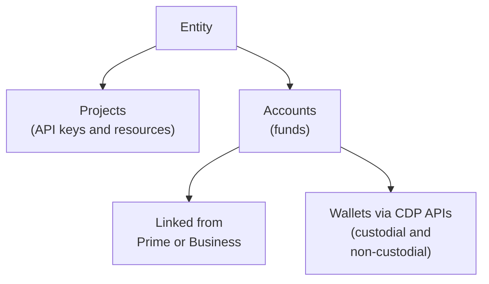

> Coinbase CDP docs — **platform** · [index](../../README.md) · [all pages](../../MANIFEST.md)

# Initial Setup

Everything you need to go from signing up to going live.

## Create your account

1. Sign up at [portal.cdp.coinbase.com](https://portal.cdp.coinbase.com).
2. Generate a Secret API key from [API Keys](https://portal.cdp.coinbase.com/api-keys/secret).

See [Authentication](/get-started/authentication/overview) for key handling and best practices.

## Custodial and non-custodial APIs

CDP offers custodial and non-custodial product APIs. Business verification is required to access the custodial APIs.

<Columns cols={2}>
  <Card title="Non-custodial" icon="bolt">
    Your users hold their own funds. Build and go live immediately, no business verification.

    * [Non-Custodial Wallets](/wallets/non-custodial-wallets/overview)
    * [Policy Engine](/wallets/security-and-policies/policy-engine/overview)
    * [Paymaster](/paymaster/introduction/welcome)
    * [Trade API](/trade-api/welcome)
    * [Onchain Data](/data/rest-api)
    * [x402](/x402/welcome)
  </Card>

  <Card title="Custodial" icon="circle-check">
    Coinbase holds or moves funds for you. Test now in the Sandbox, then verify your business to use real funds.

    * [Custodial Wallets](/wallets/custodial-wallets/overview)
    * [Transfers](/payments/transfers/overview)
    * [Payments](/payments/overview)
    * [Payment Acceptance](/payments/payment-acceptance/overview)
    * [Customers (KYC)](/customers-kyc/overview)
    * [Custom Stablecoins](/custom-stablecoins/overview)
  </Card>
</Columns>

## Make your first call

How you make your first call depends on which set you're building with.

### Non-custodial APIs

Build and go live immediately, with no business verification. The [CDP CLI](/coinbase-cli/overview) covers the full CDP API (wallets, data, policies, onramp, x402) and doubles as an [MCP server](/ai-agents/cdp-for-agents/cdp-mcp), so AI agents get typed tool access to every endpoint.

#### From your terminal

<Steps>
  <Step title="Install (Node.js 22+)">
    ```bash Terminal theme={null}
    npm install -g @coinbase/cdp-cli
    ```
  </Step>

  <Step title="Configure credentials">
    Download an [API key](https://portal.cdp.coinbase.com/api-keys/secret) and a [wallet secret](https://portal.cdp.coinbase.com/wallets/non-custodial/security) from the CDP Portal, then load each into the CLI:

    ```bash Terminal theme={null}
    cdp env live --key-file ./cdp_api_key.json
    cdp env live --wallet-secret-file ./cdp_wallet_secret.txt
    ```
  </Step>

  <Step title="Create and fund a testnet account">
    ```bash Terminal theme={null}
    cdp evm accounts create name=my-wallet
    address=$(cdp evm accounts by-name my-wallet --jq '.address')
    cdp evm faucet address=$address network=base-sepolia token=eth
    ```

    You've created and funded your first account from the CLI. The full encode-sign-send pipeline (and Solana, smart accounts, swaps, x402, and more) is covered in the [CDP CLI overview](/coinbase-cli/overview).
  </Step>
</Steps>

#### From an agent session

Point the agent at the CDP CLI onboarding skill. It installs, configures, and verifies the CLI:

```text Prompt theme={null}
docs.cdp.coinbase.com/cdp-cli/skill.md
```

To register the CLI's MCP server (Claude Code example):

```bash Terminal theme={null}
claude mcp add --scope user --transport stdio cdp -- cdp mcp
```

For other agents and bundled-skill installation, see [CDP for agents](/ai-agents/cdp-for-agents/cdp-mcp).

### Custodial APIs

Build and test immediately in the [Sandbox](/get-started/sandbox/quickstart) with simulated funds. It uses the same endpoints, authentication, and response formats as production, so there's nothing new to learn when you go live.

When you're ready for real funds, [verify your business and go live](#verify-your-business-and-go-live).

## Verify your business and go live

Complete these steps to go live with custodial APIs:

<Steps>
  <Step title="Verify your business">
    Verify through Coinbase Prime or Coinbase Business:

    <Columns cols={2}>
      <Card title="Coinbase Prime" icon="building-columns" href="https://prime.coinbase.com">
        For large organizations and institutions. Apply at prime.coinbase.com.
      </Card>

      <Card title="Coinbase Business" icon="briefcase" href="https://www.coinbase.com/business">
        For small to mid-sized businesses. Sign up at coinbase.com/business.
      </Card>
    </Columns>

    Both require business documentation such as incorporation certificates, beneficial owner information, and proof of address. For the list of endpoints unlocked after verification, see the [API reference](/api-reference/v2/introduction).
  </Step>

  <Step title="Link your account">
    Linking accounts requires the **CDP Admin** role. Whoever completes business verification is granted it automatically once the account is approved. To link your account:

    1. From any Coinbase product, open the product menu in the top right and select **CDP** to open the CDP Portal.
    2. Once in the Portal, go to the **Accounts** page and click **Link account**.
    3. Choose the Prime or Business accounts you want to make available in CDP.

    Linking makes your verified account usable from CDP: it inherits the account's verified status (shown as type `business` or `prime`) and unlocks the custodial APIs.
  </Step>

  <Step title="Switch to Live">
    Switch the Portal from Sandbox to **Live** and create Live API keys. Sandbox and Live keys are not interchangeable, so use Live keys only against the Live environment.
  </Step>
</Steps>

## Manage your team

Team management is handled in [Coinbase Workspace](https://workspace.coinbase.com/). Roles are scoped to each surface, and a teammate can hold more than one:

| Surface | Roles | What they control |
| - | - | - |
| **CDP** | CDP Admin, CDP Viewer | Access to CDP resources. Admins can link accounts |
| **Workspace** | Workspace Admin, Workspace Viewer | Access to the team. Admins manage members and roles |

## How your account and funds are organized

Once you're set up, the Portal organizes your work into a few layers.

Your **entity** is your company. It maps to one legal business and carries your verified status. Manage keys, billing, and configuration in **Settings**.

As you build, you'll mainly work with two resources under your entity:

* **Projects** hold your API keys and resources. CDP creates your first project automatically, and you can add more to keep separate work apart.
* **Accounts** hold funds. There are two kinds: accounts linked from Coinbase Prime or Coinbase Business, and wallets you create with the CDP APIs (custodial and non-custodial). Each account can have deposit addresses, reporting, and bank settlement.



## Where to go next

<CardGroup cols={3}>
  <Card title="API reference" href="/api-reference/v2/introduction" icon="book-open">
    Explore all endpoints.
  </Card>

  <Card title="Explore use cases" href="/get-started/overview#build-by-use-case" icon="compass">
    See common use cases and the products behind them.
  </Card>

  <Card title="Sandbox" href="/get-started/sandbox/overview" icon="flask">
    Build and test with simulated funds, no verification.
  </Card>
</CardGroup>

## Support

* For **Coinbase Prime**, visit [prime.coinbase.com](https://prime.coinbase.com) or contact your Coinbase relationship manager.
* For **Coinbase Business**, visit [coinbase.com/business](https://www.coinbase.com/business) or reach out via the [CDP Discord](https://discord.com/invite/cdp).
