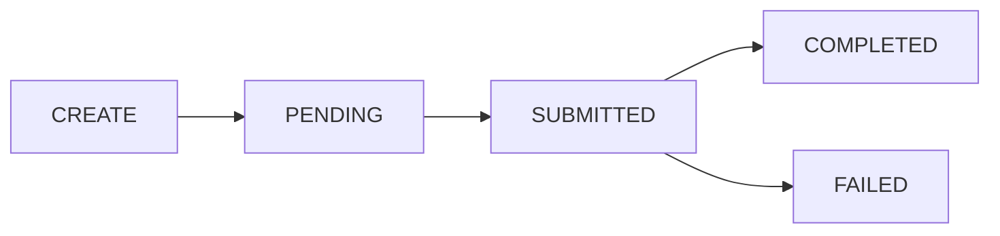

> Coinbase CDP docs — **wallets** · [index](../../README.md) · [all pages](../../MANIFEST.md)

# EIP-7702

[EIP-7702](https://eips.ethereum.org/EIPS/eip-7702) upgrades an existing EOA with smart account capabilities (batched transactions, gas sponsorship, and spend permissions) while keeping the same address.

Unlike [ERC-4337 smart accounts](/wallets/using-wallets/smart-accounts), which create a separate contract account, EIP-7702 upgrades your user's **existing EOA in place**.

<Tip>
  **Mainnet delegations are sponsored by Coinbase**, so end users do not need to hold any ETH before delegating on Base, Arbitrum, Ethereum, Optimism, or Polygon.

  **On testnets** (Base Sepolia, Ethereum Sepolia), the delegation transaction requires ETH in the user's EOA. Use the [CDP Faucet](/faucets/introduction/welcome) to fund accounts for testing.
</Tip>

## Operation lifecycle

Delegation is asynchronous. When you create a delegation, the API returns an operation ID immediately while the transaction is submitted and confirmed onchain. You poll the operation until it reaches `COMPLETED`, at which point the account is ready to send user operations.



| Status | Meaning |
| - | - |
| `PENDING` | The delegation operation has been created but not yet submitted to the network. |
| `SUBMITTED` | The delegation transaction has been submitted to the network. |
| `COMPLETED` | The delegation is active. The account can now submit user operations. |
| `FAILED` | The delegation failed. |

## Create an EIP-7702 delegation

<Tabs>
  <Tab title="React">
    `useCreateEvmEip7702Delegation` creates the delegation and automatically polls until it reaches a terminal state.

    ```tsx theme={null}
    import { EvmEip7702DelegationNetwork } from "@coinbase/cdp-api-client";
    import { useCreateEvmEip7702Delegation, useCurrentUser } from "@coinbase/cdp-hooks";

    function DelegateAccount() {
      const { createEvmEip7702Delegation, data, status: operation, error } = useCreateEvmEip7702Delegation();
      const { currentUser } = useCurrentUser();

      const handleDelegate = async () => {
        const eoaAddress = currentUser?.evmAccountObjects?.[0]?.address;
        if (!eoaAddress) return;

        await createEvmEip7702Delegation({
          address: eoaAddress,
          network: EvmEip7702DelegationNetwork["base-sepolia"],
          enableSpendPermissions: false,
        });
      };

      const isInProgress = !!data && !operation && !error;

      return (
        <div>
          <button onClick={handleDelegate} disabled={isInProgress}>
            {isInProgress ? "Delegating..." : "Upgrade Account"}
          </button>

          {isInProgress && <p>Waiting for delegation to complete...</p>}

          {operation?.status === "COMPLETED" && (
            <p>Delegation complete! Tx: {operation.transactionHash}</p>
          )}

          {operation?.status === "FAILED" && <p>Delegation failed. Please try again.</p>}
          {error && <p>Error: {error.message}</p>}
        </div>
      );
    }
    ```
  </Tab>

  <Tab title="Node (TypeScript)">
    ```typescript theme={null}
    const account = await cdp.evm.getOrCreateAccount({ name: "My-EIP7702-Account" });

    const { delegationOperationId } = await cdp.evm.createEvmEip7702Delegation({
      address: account.address,
      network: "base-sepolia",
      enableSpendPermissions: false,
    });

    console.log("Delegation operation created:", delegationOperationId);
    ```
  </Tab>

  <Tab title="Python">
    ```python theme={null}
    account = await cdp.evm.get_or_create_account(name="My-EIP7702-Account")

    delegation_operation_id = await cdp.evm.create_evm_eip7702_delegation(
        address=account.address,
        network="base-sepolia",
        enable_spend_permissions=False,
    )

    print(f"Delegation operation created: {delegation_operation_id}")
    ```
  </Tab>
</Tabs>

## Poll for completion

After creating a delegation, poll for its status to know when the account is ready to send user operations.

<Tabs>
  <Tab title="React">
    `useCreateEvmEip7702Delegation` polls automatically. For standalone polling, use `useWaitForEvmEip7702Delegation`:

    ```tsx theme={null}
    import { useWaitForEvmEip7702Delegation } from "@coinbase/cdp-hooks";

    function DelegationStatus({ delegationOperationId }: { delegationOperationId: string }) {
      const { data, error } = useWaitForEvmEip7702Delegation({
        delegationOperationId,
        enabled: true, // set to false to pause polling
      });

      if (error) return <p>Error: {error.message}</p>;
      if (!data) return <p>Loading...</p>;

      return (
        <div>
          <p>Status: {data.status}</p>
          {data.transactionHash && <p>Tx: {data.transactionHash}</p>}
          {data.delegateAddress && <p>Delegate: {data.delegateAddress}</p>}
        </div>
      );
    }
    ```

    For a one-shot status check without polling, use `useGetEvmEip7702DelegationOperation`:

    ```tsx theme={null}
    import { useGetEvmEip7702DelegationOperation } from "@coinbase/cdp-hooks";

    function CheckStatus() {
      const { getEvmEip7702DelegationOperation, data } = useGetEvmEip7702DelegationOperation();

      return (
        <div>
          <button onClick={() => getEvmEip7702DelegationOperation({ delegationOperationId: "your-operation-id" })}>
            Check Status
          </button>
          {data && <p>Status: {data.status}</p>}
        </div>
      );
    }
    ```
  </Tab>

  <Tab title="Node (TypeScript)">
    Use `waitForEvmEip7702DelegationOperationStatus` to poll until the operation reaches a terminal state. For a one-shot check, use `getEvmEip7702DelegationOperationById`.

    ```typescript theme={null}
    const operation = await cdp.evm.waitForEvmEip7702DelegationOperationStatus({
      delegationOperationId,
      waitOptions: {
        timeoutSeconds: 60,   // optional, default: 60
        intervalSeconds: 0.2, // optional, default: 0.2
      },
    });

    console.log("Status:", operation.status);
    console.log("Tx:", operation.transactionHash);
    ```

    To check the status once without waiting:

    ```typescript theme={null}
    const operation = await cdp.evm.getEvmEip7702DelegationOperationById(
      delegationOperationId,
    );
    console.log(operation.status);
    // => "PENDING" | "SUBMITTED" | "COMPLETED" | "FAILED"
    ```
  </Tab>

  <Tab title="Python">
    Use `wait_for_evm_eip7702_delegation_operation_status` to poll until the operation reaches a terminal state. For a one-shot check, use `get_evm_eip7702_delegation_operation_by_id`.

    ```python theme={null}
    operation = await cdp.evm.wait_for_evm_eip7702_delegation_operation_status(
        delegation_operation_id=delegation_operation_id,
        timeout_seconds=60,    # optional, default: 60
        interval_seconds=0.2,  # optional, default: 0.2
    )

    print(f"Status: {operation.status}")
    print(f"Tx: {operation.transaction_hash}")
    ```

    To check the status once without waiting:

    ```python theme={null}
    operation = await cdp.evm.get_evm_eip7702_delegation_operation_by_id(
        delegation_operation_id=delegation_operation_id,
    )
    print(operation.status)
    # => "PENDING" | "SUBMITTED" | "COMPLETED" | "FAILED"
    ```
  </Tab>
</Tabs>

## Use the delegated account

Once delegation is complete, the EOA has full smart account capabilities. Send user operations the same way as with ERC-4337 smart accounts.

<Tabs>
  <Tab title="React">
    After delegation completes, use `useSendUserOperation` with the user's EOA address. No extra setup needed.

    ```tsx theme={null}
    import { useSendUserOperation, useCurrentUser } from "@coinbase/cdp-hooks";

    function SendOperation() {
      const { sendUserOperation, status } = useSendUserOperation();
      const { currentUser } = useCurrentUser();

      const handleSend = async () => {
        const eoaAddress = currentUser?.evmAccountObjects?.[0]?.address;
        if (!eoaAddress) return;

        await sendUserOperation({
          evmSmartAccount: eoaAddress,
          network: "base-sepolia",
          calls: [{ to: "0x000...000", value: 0n, data: "0x" }],
        });
      };

      return (
        <button onClick={handleSend} disabled={status === "pending"}>
          {status === "pending" ? "Sending..." : "Send"}
        </button>
      );
    }
    ```
  </Tab>

  <Tab title="Node (TypeScript)">
    Use `toEvmDelegatedAccount` to convert the account, then call `sendUserOperation` on the delegated account.

    ```typescript theme={null}
    import { toEvmDelegatedAccount } from "@coinbase/cdp-sdk";
    import { parseEther } from "viem";

    const delegatedAccount = toEvmDelegatedAccount(account);

    const { userOpHash } = await delegatedAccount.sendUserOperation({
      network: "base-sepolia",
      calls: [
        {
          to: "0x0000000000000000000000000000000000000000",
          value: parseEther("0"),
          data: "0x",
        },
      ],
    });

    console.log("User operation submitted:", userOpHash);
    ```
  </Tab>

  <Tab title="Python">
    Use `to_evm_delegated_account` to convert the account, then call `send_user_operation`.

    ```python theme={null}
    from cdp import to_evm_delegated_account
    from cdp.evm_call_types import EncodedCall

    delegated = to_evm_delegated_account(account)

    user_op = await delegated.send_user_operation(
        calls=[
            EncodedCall(
                to="0x0000000000000000000000000000000000000000",
                value=0,
                data="0x",
            )
        ],
        network="base-sepolia",
    )

    print(f"User operation submitted: {user_op.user_op_hash}")
    ```
  </Tab>
</Tabs>

## Supported networks

<CardGroup cols={2}>
  <Card title="Mainnets" icon="globe">
    Arbitrum, Base, Ethereum, Optimism, Polygon

    Delegation transactions are sponsored by Coinbase. No ETH required. Pair with the [CDP Paymaster](/paymaster/introduction/welcome) on Base, or any [ERC-7677](https://eips.ethereum.org/EIPS/eip-7677)-compatible paymaster on other networks, for gasless user operations.
  </Card>

  <Card title="Testnets" icon="flask">
    Base Sepolia, Ethereum Sepolia

    The EOA must hold ETH to pay for the delegation transaction. Use the [CDP Faucet](/faucets/introduction/welcome) to fund accounts before delegating.
  </Card>
</CardGroup>
